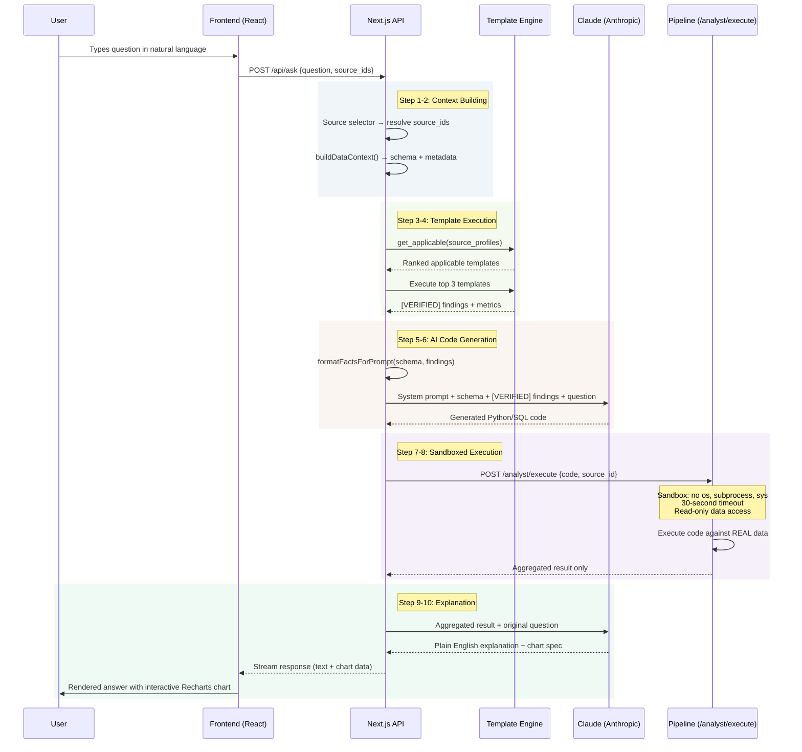
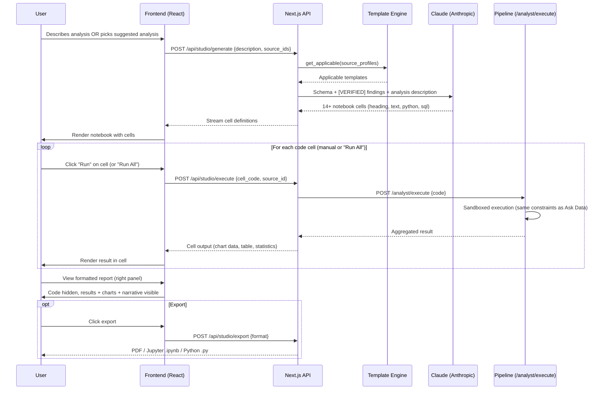
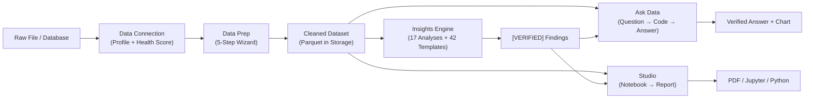

Ask Data and Studio are the two interactive modes where users consume insights. Both are built on the same verified architecture: templates compute facts, AI explains them, and at **no point does Claude see raw data rows**.

## Ask Data: Conversational Analytics

Ask Data turns natural-language questions into verified, chart-backed answers. Here is every step of the pipeline, from keystroke to rendered response.

### Full Sequence Diagram



### Step-by-Step Walkthrough

<Steps>
  <Step title="1. User types question">
    The user enters a natural-language question in the Ask Data input field. Questions can be in English or German:

    - "Which product category grew fastest last quarter?"
    - "Zeige mir die Kundenabwanderung nach Region"
    - "What is our customer concentration risk?"
    - "Vergleiche den Umsatz Q3 vs Q4 nach Produktgruppe"

    The frontend sends the question, selected source IDs, and conversation history (for follow-up context) to the API.
  </Step>

  <Step title="2. Source selection and context extraction">
    The **source selector** resolves which data sources to query. If the user explicitly selected sources, those are used. Otherwise, DataLaser infers the best sources based on keyword matching against column names and source descriptions.

    `buildDataContext()` then extracts metadata for the selected sources:

    | Extracted | Example |
    |-----------|---------|
    | Column names and types | `Umsatz (float)`, `Produkt (string)`, `Datum (date)` |
    | Row count | `24,831 rows` |
    | Date ranges | `2023-01-01 to 2025-12-31` |
    | Semantic roles | `measure:revenue`, `dimension:product`, `date` |
    | Value ranges (aggregated) | `Umsatz: min 12.50, max 142,350, median 1,240` |

    <Warning>
      `buildDataContext()` extracts **only schema-level metadata and aggregated statistics**. It never includes raw data rows, individual record values, or personally identifiable information. This is enforced at the code level. The function physically cannot access row-level data.
    </Warning>
  </Step>

  <Step title="3. Template matching">
    `get_applicable()` runs the template pattern matcher against the source profiles (the same matcher described in the [Insights Engine](/architecture/insights-engine)):

    - Tests all 42 templates against the dataset's column names and roles
    - Filters to templates with confidence > 0.5
    - Ranks by confidence score
    - Selects the **top 3** most applicable templates
  </Step>

  <Step title="4. Template execution">
    The top 3 templates execute their pure Python/Polars computation code against the cleaned dataset. Each produces `[VERIFIED]` findings:

    ```
    [VERIFIED] Top 3 customers account for 67% of Umsatz — Klumpenrisiko
    [VERIFIED] Product "Maschinenteile A" generates 142,350 EUR (23% of total)
    [VERIFIED] Revenue growth: +8.2% QoQ, driven by DACH region (+14.3%)
    ```

    These findings are computed before Claude sees anything.
  </Step>

  <Step title="5. Prompt construction">
    `formatFactsForPrompt()` assembles the complete context for Claude:

    ```
    SYSTEM: You are a data analyst. Answer the user's question using ONLY
    the verified findings and schema provided. Do not compute, estimate,
    or infer numbers. Generate Python code to answer the question.

    SCHEMA:
    Source: sales_2024.csv (24,831 rows)
    Columns: Umsatz (float, measure:revenue), Produkt (string, dimension:product),
    Region (string, dimension:geo), Datum (date), Menge (int, measure:quantity)
    Date range: 2023-01-01 to 2025-12-31

    VERIFIED FINDINGS:
    [VERIFIED] Top 3 customers account for 67% of Umsatz
    [VERIFIED] Revenue growth: +8.2% QoQ
    [VERIFIED] Seasonal pattern: Q4 is 2.3x Q1

    USER QUESTION: Which product category grew fastest last quarter?
    ```

    Note what Claude receives: schema metadata + verified findings + the question. No raw data.
  </Step>

  <Step title="6. Claude generates code">
    Claude generates Python (or SQL) code to answer the specific question. The code uses Polars to query the cleaned dataset:

    ```python
    import polars as pl

    df = pl.read_parquet("data://sales_2024")
    last_quarter = df.filter(
        pl.col("Datum").is_between("2025-10-01", "2025-12-31")
    )
    prev_quarter = df.filter(
        pl.col("Datum").is_between("2025-07-01", "2025-09-30")
    )

    growth = (
        last_quarter.group_by("Produkt").agg(pl.col("Umsatz").sum())
        .join(
            prev_quarter.group_by("Produkt").agg(pl.col("Umsatz").sum()),
            on="Produkt", suffix="_prev"
        )
        .with_columns(
            ((pl.col("Umsatz") - pl.col("Umsatz_prev")) / pl.col("Umsatz_prev") * 100)
            .alias("growth_pct")
        )
        .sort("growth_pct", descending=True)
    )

    result = growth.head(10).to_dicts()
    ```

    Claude sees column names from the schema but writes code that runs against real data. It does not fabricate the output.
  </Step>

  <Step title="7. Sandboxed execution">
    The generated code is sent to the Pipeline service at `/analyst/execute`. The sandbox enforces strict security:

    | Constraint | Enforcement |
    |-----------|-------------|
    | No filesystem access | `os`, `subprocess`, `sys` modules blocked at import level |
    | Timeout | 30-second hard limit; process killed if exceeded |
    | Read-only data | Code can read the cleaned Parquet file but cannot write, delete, or modify |
    | No network access | All outbound connections blocked |
    | Memory limit | 2 GB per execution; OOM triggers graceful failure |
    | Output limit | Only aggregated results returned; raw DataFrame dumps blocked |

    The sandbox executes the code against the **real cleaned dataset** and returns only the aggregated result (e.g., a list of 10 dictionaries with product names and growth percentages).

    <Note>
      The Pipeline sandbox is a process-level isolation environment. Even if the generated code contained malicious instructions, it cannot access the filesystem, network, or other users' data.
    </Note>
  </Step>

  <Step title="8. Aggregated result returns">
    The Pipeline returns only the computation result, meaning aggregated data, never raw rows:

    ```json
    {
      "result": [
        {"Produkt": "Elektronik", "growth_pct": 34.2},
        {"Produkt": "Maschinenteile", "growth_pct": 18.7},
        {"Produkt": "Verpackung", "growth_pct": 12.1}
      ],
      "execution_time_ms": 245,
      "rows_scanned": 24831,
      "rows_returned": 10
    }
    ```
  </Step>

  <Step title="9. Claude writes explanation">
    Claude receives the aggregated result and the original question, then generates a plain-language explanation:

    > "Elektronik grew the fastest last quarter with **+34.2% quarter-over-quarter growth**, followed by Maschinenteile (+18.7%) and Verpackung (+12.1%). This aligns with the verified seasonal pattern: Q4 typically shows 2.3x the revenue of Q1, and electronics categories tend to benefit most from year-end purchasing."

    Claude also specifies the chart type and configuration for visualization.
  </Step>

  <Step title="10. Response streams to user">
    The response streams to the frontend in real-time (server-sent events). The user sees:

    1. **Text explanation**: appearing word by word as it streams
    2. **Interactive chart**: rendered with Recharts once the chart specification arrives
    3. **Source attribution**: which templates and datasets produced the answer
    4. **Follow-up suggestions**: related questions the user might want to ask next
  </Step>
</Steps>

<Info>
  The complete round-trip from question to rendered answer typically takes 3-8 seconds: ~1s for template execution, ~2-4s for Claude to generate code and explanation, ~0.5s for sandbox execution, and ~0.5s for rendering.
</Info>

## Studio: Professional Notebooks

Studio provides a notebook environment for deep-dive analysis. Unlike Ask Data (which answers single questions), Studio produces comprehensive, multi-cell analyses that can be exported as reports.

### Full Sequence Diagram



### Studio Walkthrough

<Steps>
  <Step title="1. Analysis initiation">
    The user starts a Studio analysis in one of two ways:

    - **Free-form description**: Types a one-sentence description (e.g., "Comprehensive revenue analysis by product and region with seasonality")
    - **Suggested analysis**: Picks from a list of suggested analyses generated by matching the dataset against the template library

    Both paths trigger template matching and AI notebook generation.
  </Step>

  <Step title="2. Template matching">
    The same template engine from the Insights Engine identifies applicable templates. For Studio, all applicable templates (not just top 3) are considered, since notebooks can cover multiple analytical angles.
  </Step>

  <Step title="3. Notebook generation">
    Claude generates a structured notebook with **14 or more cells**. Each cell has a type:

    | Cell Type | Purpose | Count (typical) |
    |-----------|---------|-----------------|
    | `heading` | Section titles and structure | 4-6 |
    | `text` | Narrative explanation and methodology notes | 3-5 |
    | `python` | Executable analysis code (Polars/Python) | 5-8 |
    | `sql` | Executable SQL queries (for database sources) | 0-3 |

    Each `python` cell contains **production-quality code**, typically 10-30 lines using real statistical methods, not toy examples:

    ```python
    import polars as pl
    import numpy as np
    from scipy import stats

    df = pl.read_parquet("data://sales_2024")

    # Seasonal decomposition using STL
    monthly = (
        df.group_by(pl.col("Datum").dt.truncate("1mo"))
        .agg(pl.col("Umsatz").sum())
        .sort("Datum")
    )

    from statsmodels.tsa.seasonal import STL
    stl = STL(monthly["Umsatz"].to_numpy(), period=12)
    res = stl.fit()

    result = {
        "trend": res.trend.tolist(),
        "seasonal": res.seasonal.tolist(),
        "residual": res.resid.tolist(),
        "seasonal_strength": 1 - (np.var(res.resid) / np.var(res.seasonal + res.resid)),
        "dates": monthly["Datum"].to_list()
    }
    ```

    <Tip>
      Studio code cells are not templates. They are custom-generated for each analysis request. However, they follow the same patterns and statistical methods used by the 42 templates, ensuring consistency and reliability.
    </Tip>
  </Step>

  <Step title="4. Cell execution">
    Users run cells individually by clicking the **Run** button on each cell, or execute the entire notebook with **Run All**.

    Each code cell follows the same execution path as Ask Data:

    1. Code sent to Pipeline `/analyst/execute`
    2. Sandboxed execution (no filesystem, no network, 30s timeout, 2 GB memory limit)
    3. Only aggregated results returned
    4. Results rendered in the cell output area

    Cell outputs are rendered according to their type:
    - **Charts**: Interactive Recharts visualizations (bar, line, scatter, heatmap, box plots)
    - **Tables**: Sortable, filterable data tables with pagination
    - **Statistics**: Formatted key-value displays with p-values, confidence intervals, and effect sizes
  </Step>

  <Step title="5. Formatted report view">
    The right panel displays the notebook as a **formatted report**:

    - Code cells are **hidden by default**. Only the narrative text and output results are visible
    - Heading cells become section headers
    - Text cells become narrative paragraphs
    - Chart outputs render inline at full width
    - Statistical results display as formatted cards

    This view is designed for sharing with stakeholders who care about findings, not code.
  </Step>

  <Step title="6. Export">
    Studio supports three export formats:

    <CardGroup cols={3}>
      <Card title="PDF" icon="file-pdf">
        The formatted report view rendered as a styled PDF document. Charts are rasterized at 2x resolution. Suitable for email attachments and presentations.
      </Card>
      <Card title="Jupyter .ipynb" icon="notebook">
        A standard Jupyter notebook file with all cells, code, and outputs preserved. Opens in JupyterLab, VS Code, or Google Colab for further analysis.
      </Card>
      <Card title="Python .py" icon="python">
        A standalone Python script containing all code cells with narrative comments. Ready to run in any Python environment with the required dependencies.
      </Card>
    </CardGroup>
  </Step>
</Steps>

## Security: What Claude Never Sees

The privacy guarantees are identical for Ask Data and Studio. This table summarizes the data boundary:

| Data Type | Sent to Claude? | Purpose |
|-----------|:-:|---------|
| Column names and types | Yes | Code generation needs to reference correct columns |
| Row count | Yes | Helps Claude write appropriate aggregations |
| Date ranges (min/max) | Yes | Enables time-based filtering in generated code |
| Value ranges (min/max/median) | Yes | Prevents code that produces empty results |
| `[VERIFIED]` template findings | Yes | Pre-computed facts for explanation |
| **Raw data rows** | **Never** | Structurally impossible. `buildDataContext()` cannot access them |
| **Individual record values** | **Never** | Only aggregated results from sandbox execution |
| **PII (names, emails, addresses)** | **Never** | Not included in schema metadata or findings |

<Warning>
  This is not a policy. It is an architectural constraint. The functions that build Claude's context physically cannot access raw rows. Even if the system prompt were modified, the code path does not provide a mechanism to include individual data points.
</Warning>

## Ask Data vs. Studio: When to Use Each

<CardGroup cols={2}>
  <Card title="Ask Data" icon="message-dots">
    **Best for:** Quick questions, ad-hoc exploration, sharing a single finding

    - One question, one answer
    - Conversational follow-ups
    - Instant chart generation
    - Share a specific insight via link
  </Card>
  <Card title="Studio" icon="notebook">
    **Best for:** Deep analysis, comprehensive reports, reproducible workflows

    - Multi-step analysis with narrative
    - Production-quality statistical code
    - Export to PDF, Jupyter, Python
    - Shareable report view (code hidden)
  </Card>
</CardGroup>

## End-to-End Data Flow Summary

From file upload to rendered insight, here is the complete journey:



At every stage, the principle holds: **deterministic code computes, AI explains**. The numbers are always real. The insights are always traceable. The raw data never leaves the secured pipeline.
