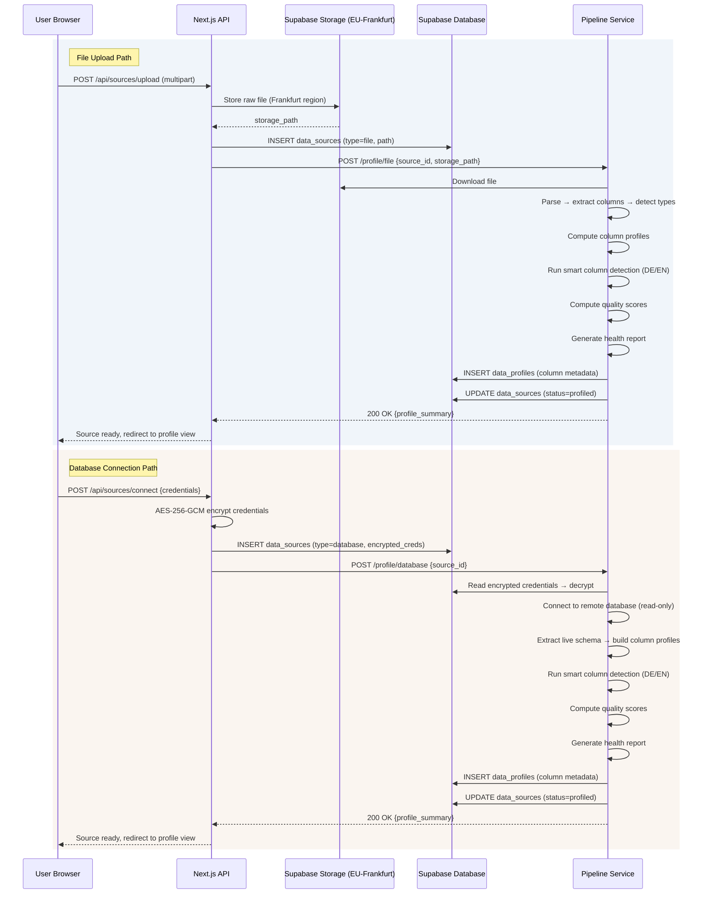

This document traces every step of the data connection pipeline, from the moment a user uploads a file or enters database credentials to the point where a fully profiled, health-scored source is ready for analysis.

## Architecture Overview



## File Upload Path

When a user uploads a file, the data flows through five distinct stages before it becomes a profiled source.

<Steps>
  <Step title="Browser upload to Next.js API">
    The user drags a file onto the Sources page or clicks **Upload File**. The browser sends a `multipart/form-data` POST to `/api/sources/upload`.

    The API route validates:
    - **File format**: CSV, Excel, JSON, or Parquet
    - **File size**: within the plan's limit (up to 1 GB for Parquet)
    - **Authentication**: valid Supabase JWT from the session

    If validation fails, the response includes an inline error with a specific fix (e.g., "File exceeds 500 MB limit for CSV. Consider converting to Parquet for up to 1 GB.").
  </Step>

  <Step title="Storage in Supabase (Frankfurt)">
    The validated file is written to **Supabase Storage** in the `eu-central-1` (Frankfurt) region. The storage path follows the pattern:

    ```
    sources/{org_id}/{source_id}/raw/{filename}
    ```

    A `data_sources` row is created in the database with `type = 'file'`, the storage path, and `status = 'uploading'`. The status transitions to `'uploaded'` once the write is confirmed.

    <Info>
      All files remain in the EU-Frankfurt region for the entire lifecycle. No data is replicated to other regions. See [EU Residency](/security/eu-residency) for details.
    </Info>
  </Step>

  <Step title="Pipeline profiling">
    The Next.js API fires an asynchronous request to the Pipeline service:

    ```
    POST /profile/file
    {
      "source_id": "src_abc123",
      "storage_path": "sources/org_x/src_abc123/raw/sales.csv"
    }
    ```

    The Pipeline service downloads the file from Storage, parses it with **Polars** (for speed, since Polars handles 1M rows in under 2 seconds), and extracts raw column metadata:

    | Extracted Field | Description |
    |----------------|-------------|
    | `name` | Column header as-is from the file |
    | `dtype` | Inferred data type (int64, float64, string, date, boolean, categorical) |
    | `null_rate` | Percentage of missing or empty values |
    | `unique_rate` | Ratio of distinct values to total rows |
    | `sample_values` | 5 representative non-null values for display |
  </Step>

  <Step title="Smart column detection">
    Immediately after type inference, the **bilingual pattern matcher** runs against every column name. This is a rules-based system, with no AI involved, that recognizes business semantics in both German and English simultaneously.

    <Tabs>
      <Tab title="German Patterns">
        | Pattern | Semantic Role | Example Columns |
        |---------|--------------|-----------------|
        | `Umsatz`, `Erlös`, `Einnahmen` | `measure:revenue` | Umsatz_2024, Gesamterlös |
        | `Menge`, `Anzahl`, `Stückzahl` | `measure:quantity` | Bestellmenge, Anzahl_Artikel |
        | `Datum`, `Zeitpunkt`, `Monat`, `Jahr` | `date` | Bestelldatum, Lieferdatum |
        | `Kunde`, `Kundenname`, `Auftraggeber` | `dimension:customer` | Kundenname, Kundennr |
        | `Produkt`, `Artikel`, `Ware` | `dimension:product` | Produktname, Artikelnr |
        | `Region`, `Gebiet`, `PLZ`, `Ort` | `dimension:geo` | Region, Lieferort |
        | `Preis`, `Kosten`, `Betrag` | `measure:monetary` | Einzelpreis, Gesamtkosten |
      </Tab>
      <Tab title="English Patterns">
        | Pattern | Semantic Role | Example Columns |
        |---------|--------------|-----------------|
        | `Revenue`, `Sales`, `Income` | `measure:revenue` | Total_Revenue, Net_Sales |
        | `Quantity`, `Count`, `Units` | `measure:quantity` | Order_Quantity, Unit_Count |
        | `Date`, `Timestamp`, `Month`, `Year` | `date` | Order_Date, Ship_Date |
        | `Customer`, `Client`, `Buyer` | `dimension:customer` | Customer_Name, Client_ID |
        | `Product`, `Item`, `SKU` | `dimension:product` | Product_Name, Item_Code |
        | `Region`, `State`, `City`, `Country` | `dimension:geo` | Ship_Region, Country |
        | `Price`, `Cost`, `Amount` | `measure:monetary` | Unit_Price, Total_Cost |
      </Tab>
    </Tabs>

    Each column receives a `semantic_role` assignment. If no pattern matches, the role defaults to `unknown` and the column is still usable but will not trigger role-specific templates.

    <Tip>
      The pattern matcher uses case-insensitive regex with word-boundary detection. A column named `customer_umsatz_monthly` correctly receives both `dimension:customer` and `measure:revenue` tags.
    </Tip>
  </Step>

  <Step title="Quality score computation and storage">
    The per-column **quality score** (0-100) is computed using a weighted formula across five dimensions:

    | Dimension | Weight | What It Measures |
    |-----------|--------|-----------------|
    | Completeness | 30% | `1 - null_rate`, penalizes missing values |
    | Type purity | 25% | Fraction of values that match the inferred dtype |
    | Outlier rate | 20% | Fraction of values outside 1.5x IQR bounds |
    | Format compliance | 15% | Consistency of date formats, number formats, string patterns |
    | Uniqueness | 10% | Appropriate uniqueness for the column's role (high for IDs, flexible for categories) |

    The **source-level quality score** is the weighted average of all column scores, where columns with more non-null values carry proportionally more weight.

    All computed metadata is stored in the `data_profiles` table:

    ```sql
    INSERT INTO data_profiles (
      source_id, column_name, dtype, null_rate,
      unique_rate, semantic_role, quality_score,
      sample_values, profile_metadata
    ) VALUES (...)
    ```

    The `data_sources` row is updated to `status = 'profiled'` with the overall quality score.
  </Step>
</Steps>

## Database Connection Path

Database connections follow a similar flow but with credential encryption as the critical first step.

<Steps>
  <Step title="Credential entry and encryption">
    The user enters connection details (host, port, database, username, password) or pastes a connection string. Before anything is stored:

    1. Credentials are encrypted with **AES-256-GCM** using a per-organization encryption key
    2. The encryption key itself is derived from a master key stored in environment variables, never in the database
    3. The encrypted blob is stored in `data_sources.encrypted_credentials`

    <Warning>
      Credentials are encrypted at the application layer before reaching the database. Even a full database compromise does not expose plaintext credentials. The decryption key exists only in the runtime environment.
    </Warning>
  </Step>

  <Step title="Connection test">
    Before saving, DataLaser tests the connection:

    1. Network reachability (TCP connect to host:port)
    2. Authentication (login with provided credentials)
    3. Read permissions (attempt `SELECT 1` or equivalent)
    4. SSL/TLS verification (if enabled)

    Failures surface inline with specific diagnostics (e.g., "Connection refused on port 5432. Verify the host allows external connections and check firewall rules.").
  </Step>

  <Step title="Live schema extraction">
    The Pipeline service connects to the remote database using the decrypted credentials and extracts:

    - All accessible schemas, tables, and views
    - Column names, native types, nullability constraints
    - Primary key and foreign key relationships
    - Row counts (estimated via `pg_stat_user_tables` or equivalent for performance)

    The schema metadata is stored locally. DataLaser does not copy the actual data for database sources during profiling.
  </Step>

  <Step title="Column profile construction">
    For each selected table, the Pipeline runs targeted SQL queries to build profiles:

    ```sql
    -- Per-column profiling query (simplified)
    SELECT
      COUNT(*) AS total_rows,
      COUNT(column_name) AS non_null_count,
      COUNT(DISTINCT column_name) AS distinct_count,
      MIN(column_name) AS min_value,
      MAX(column_name) AS max_value,
      AVG(column_name) AS mean_value  -- numeric only
    FROM table_name
    ```

    These aggregated statistics, never raw rows, are used to compute the same quality score and semantic role assignments as the file path.
  </Step>

  <Step title="Profile storage">
    Column metadata, quality scores, semantic roles, and health reports are written to `data_profiles` exactly as in the file path. The `data_sources` status transitions to `'profiled'`.
  </Step>
</Steps>

## Health Report Generation

After profiling completes (for both file and database paths), the Pipeline generates a **health report**, a structured list of findings about the source's data quality.

Each finding is categorized into one of three severity levels:

<CardGroup cols={3}>
  <Card title="Issue" icon="circle-exclamation">
    A problem that **penalizes the quality score** and should be fixed before analysis. Examples:

    - Column `revenue` has 34% null values
    - Column `date` contains 12 unparseable values
    - Column `customer_id` has 0% uniqueness (all identical)
  </Card>
  <Card title="Characteristic" icon="circle-info">
    An observation that is **noted but acceptable**. The quality score is not penalized. Examples:

    - Column `region` has 4 distinct values (low cardinality)
    - Column `amount` has a right-skewed distribution
    - 3 columns detected as German-language headers
  </Card>
  <Card title="Info" icon="circle-check">
    Neutral metadata for context. Examples:

    - 15,432 rows detected
    - Encoding: UTF-8 with BOM
    - Date range: 2021-01-15 to 2024-12-31
  </Card>
</CardGroup>

The health report is stored as a JSON array in `data_sources.health_report` and rendered in the source's **Health** tab as a sorted, filterable list.

<Note>
  Health reports are re-generated after every sync refresh and after every Data Prep run. The history of past reports is preserved for trend comparison, so you can see whether data quality is improving or degrading over time.
</Note>

## What Happens Next

Once a source is profiled, it is ready for the next stage of the pipeline:

<CardGroup cols={3}>
  <Card title="Data Prep" icon="wand-magic-sparkles" href="/architecture/data-prep-pipeline">
    Clean and transform the data through the 5-step wizard.
  </Card>
  <Card title="Insights" icon="lightbulb" href="/architecture/insights-engine">
    Jump directly to auto-analysis if the quality score is high enough.
  </Card>
  <Card title="Ask Data" icon="message-dots" href="/architecture/ask-and-studio">
    Start asking questions immediately. DataLaser uses the profile metadata to scope queries.
  </Card>
</CardGroup>

<Info>
  If the source-level quality score is below 60, DataLaser recommends running Data Prep before analysis. You can proceed anyway, but a persistent warning will appear on all downstream results indicating that data quality issues may affect accuracy.
</Info>
