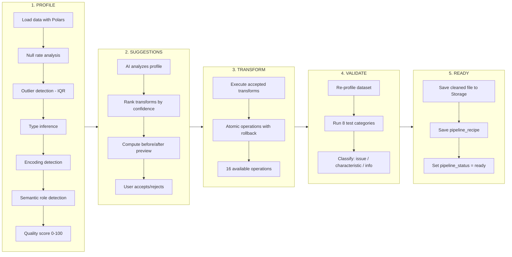
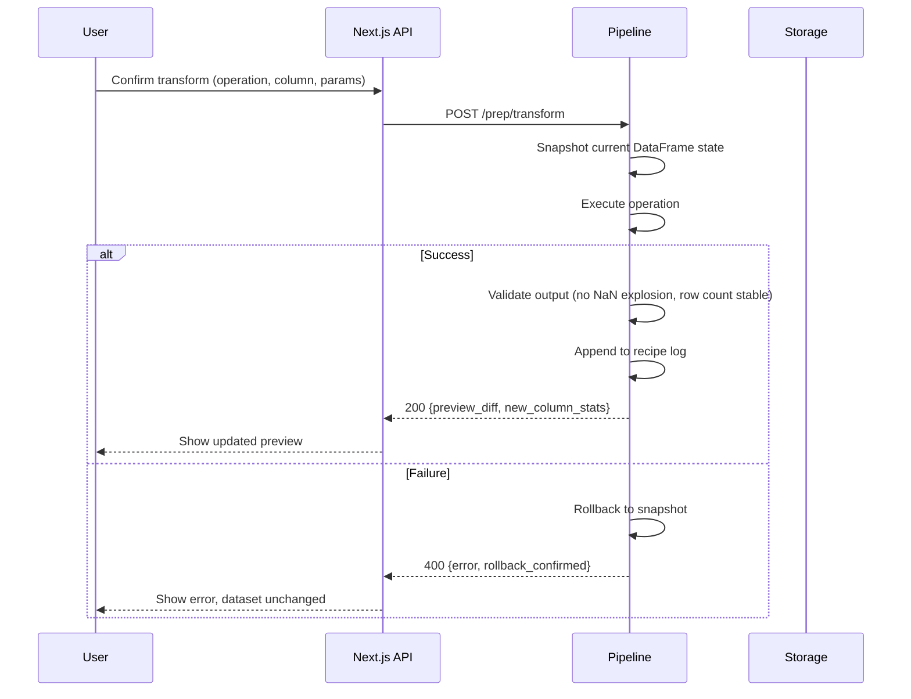

The Data Preparation Pipeline is the bridge between raw, messy data and analysis-ready datasets. This document traces every operation, data structure, and decision point across the five-step wizard.

## Pipeline Architecture



## Step 1: PROFILE

The profiler is the foundation of every decision downstream. It runs entirely in Python using **Polars** for columnar processing, with no AI calls and no external services.

<Steps>
  <Step title="Data loading">
    The Pipeline service loads the raw file from Supabase Storage into a Polars DataFrame. For database sources, a materialized snapshot is created first.

    - **CSV**: Auto-detects delimiter (`,`, `;`, `\t`, `|`), encoding (UTF-8, Latin-1, Windows-1252), and header row
    - **Excel**: Reads the selected sheet, handles merged cells by forward-filling
    - **JSON**: Flattens nested structures to a tabular format with dot-notation column names
    - **Parquet**: Native columnar read. Fastest path, no parsing needed
  </Step>

  <Step title="Null rate analysis">
    For every column, the profiler computes:

    ```python
    null_rate = (null_count + empty_string_count + whitespace_only_count) / total_rows
    ```

    DataLaser treats empty strings and whitespace-only values as effective nulls, a common source of hidden data quality problems in CSV files exported from spreadsheets.
  </Step>

  <Step title="Outlier detection (IQR method)">
    For numeric columns, outliers are identified using the Interquartile Range method:

    ```
    Q1 = 25th percentile
    Q3 = 75th percentile
    IQR = Q3 - Q1
    Lower bound = Q1 - 1.5 * IQR
    Upper bound = Q3 + 1.5 * IQR
    ```

    Values outside these bounds are flagged as outliers. The `outlier_rate` (fraction of values outside bounds) feeds into the quality score.

    <Info>
      The IQR method is preferred over Z-score for profiling because it is robust against skewed distributions, which are common in business data where revenue or order quantities often have a long right tail.
    </Info>
  </Step>

  <Step title="Type inference">
    Each column is classified into one of six types:

    | Type | Detection Logic |
    |------|----------------|
    | `integer` | All non-null values parse as integers, no decimal points |
    | `float` | All non-null values parse as numbers, at least one has decimals |
    | `string` | Default fallback for non-numeric, non-date, non-boolean |
    | `date` | Matches known date patterns (ISO 8601, DD.MM.YYYY, MM/DD/YYYY, etc.) |
    | `boolean` | Values are exclusively from {true, false, 0, 1, yes, no, ja, nein} |
    | `categorical` | String column with `unique_rate < 0.05` (fewer than 5% unique values) |

    Type purity is the fraction of non-null values that conform to the inferred type. A column inferred as `float` with 3% of values being unparseable strings has a type purity of 97%.
  </Step>

  <Step title="Encoding detection">
    The profiler checks for:

    - **Mojibake**: corrupted characters from encoding mismatches (e.g., `München` instead of `München`)
    - **BOM markers**: UTF-8 BOM bytes that appear as invisible characters
    - **Mixed encoding**: columns where some values are UTF-8 and others are Latin-1

    Encoding issues are flagged as `issue` severity in the health report.
  </Step>

  <Step title="Semantic role detection">
    Every column receives a semantic role classification. The detector uses a priority cascade:

    1. **Name-based matching**: bilingual regex patterns against the column name (see [Data Connection](/architecture/data-connection) for the full pattern table)
    2. **Value-based inference**: if no name match, sample values are analyzed:
       - All values are dates → `date`
       - Numeric with high variance → `measure`
       - String with low cardinality → `dimension`
       - Numeric with near-zero variance, values in {0, 1} → `binary`
       - High uniqueness + sequential integers → `id`
    3. **Default**: `unknown`

    Roles assigned: `measure`, `dimension`, `date`, `binary`, `id`, `unknown`
  </Step>

  <Step title="Quality score computation">
    The per-column quality score combines five weighted dimensions:

    ```
    score = (
        0.30 * completeness     +  # 1 - null_rate
        0.25 * type_purity      +  # fraction matching inferred type
        0.20 * (1 - outlier_rate) + # fraction within IQR bounds
        0.15 * format_compliance +  # consistency of formats
        0.10 * uniqueness_fit      # appropriate uniqueness for role
    ) * 100
    ```

    The source-level score is a row-count-weighted average of all column scores. The profile summary is stored in `data_profiles` and displayed as an interactive table with sparkline distributions.
  </Step>
</Steps>

<Tip>
  Profiling runs in under 10 seconds for datasets up to 1 million rows. For larger datasets, Polars processes a stratified sample of 500K rows and extrapolates statistics with confidence intervals noted in the output.
</Tip>

## Step 2: SUGGESTIONS

After profiling, the AI engine analyzes the profile statistics to generate ranked transformation suggestions. This is the one step that involves an AI call, but it receives only **profile metadata**, never raw data rows.

<Steps>
  <Step title="Profile analysis">
    The suggestion engine receives:

    - Column names, types, semantic roles
    - Null rates, outlier rates, type purity scores
    - Quality scores and health report findings
    - Dataset row count and column count

    It does NOT receive: sample values, raw data, or individual row information.
  </Step>

  <Step title="Confidence-ranked suggestions">
    Each suggestion includes:

    | Field | Description |
    |-------|-------------|
    | `operation` | One of the 16 supported transforms |
    | `column` | Target column name |
    | `confidence` | 0.0-1.0 score based on how clearly the profile indicates this fix |
    | `impact` | Projected quality score improvement |
    | `reason` | Plain-language explanation of why this is recommended |

    Suggestions are sorted by `confidence * impact` in descending order. High-confidence, high-impact fixes appear first.

    Example suggestion:
    ```json
    {
      "operation": "fill_median",
      "column": "revenue",
      "confidence": 0.92,
      "impact": 8.5,
      "reason": "Column 'revenue' has 12.3% null values. Median fill preserves the distribution better than mean because the column has right-skewed data (skewness: 2.4)."
    }
    ```
  </Step>

  <Step title="Before/after preview">
    For each suggestion, a **before/after preview** is computed on a sample of 10 affected rows. The preview shows:

    - The original values (or nulls)
    - What the values would become after the transform
    - The projected column quality score change

    This preview runs locally in the Pipeline, with no additional AI calls.
  </Step>

  <Step title="User decision">
    The user reviews each suggestion card and takes one of three actions:

    - **Accept**: queues the transform for Step 3
    - **Reject**: dismisses the suggestion
    - **Edit**: modifies parameters (e.g., change `fill_median` to `fill_constant` with a specific value)

    Accepted suggestions are ordered by their original ranking and passed to Step 3 as a transform queue.
  </Step>
</Steps>

## Step 3: TRANSFORM

Transforms execute as **atomic operations**. Each one either succeeds completely or rolls back entirely. No partial transforms can corrupt the dataset.

### The 16 Operations

<Tabs>
  <Tab title="Missing Data (1-6)">
    | # | Operation | Applies To | Behavior |
    |---|-----------|-----------|----------|
    | 1 | `fill_mean` | Numeric | Replace nulls with column mean |
    | 2 | `fill_median` | Numeric | Replace nulls with column median (outlier-resistant) |
    | 3 | `fill_mode` | Categorical | Replace nulls with most frequent value |
    | 4 | `fill_constant` | Any | Replace nulls with a user-specified value |
    | 5 | `forward_fill` | Time-series | Carry last known value forward (requires sorted date column) |
    | 6 | `drop_rows` | Any | Remove rows where the target column is null |
  </Tab>
  <Tab title="Type & Format (7-10)">
    | # | Operation | Applies To | Behavior |
    |---|-----------|-----------|----------|
    | 7 | `cast_type` | Any | Convert between string, int, float, date, boolean |
    | 8 | `parse_dates` | String | Auto-detect or specify format string; handles DD.MM.YYYY, MM/DD/YYYY, ISO 8601 |
    | 9 | `normalize_encoding` | String | Fix UTF-8 issues, strip BOM, resolve mojibake |
    | 10 | `standardize_case` | String | Apply lower, upper, title, or sentence case |
  </Tab>
  <Tab title="Structure (11-14)">
    | # | Operation | Applies To | Behavior |
    |---|-----------|-----------|----------|
    | 11 | `rename` | Any | Change column header name |
    | 12 | `drop_column` | Any | Remove column from dataset entirely |
    | 13 | `deduplicate` | Row-level | Remove identical rows; keep first, last, or none |
    | 14 | `split_column` | String | Split by delimiter into multiple new columns |
  </Tab>
  <Tab title="Values (15-16)">
    | # | Operation | Applies To | Behavior |
    |---|-----------|-----------|----------|
    | 15 | `clip_outliers` | Numeric | Cap values at percentile bounds (e.g., 1st-99th) |
    | 16 | `map_values` | Any | Replace specific values with new ones (find-and-replace mapping) |
  </Tab>
</Tabs>

### Execution Model

Each transform follows this lifecycle:



<Warning>
  Transforms are applied in sequence. Order matters: filling nulls before clipping outliers produces different results than the reverse. The recipe preserves this order exactly.
</Warning>

## Step 4: VALIDATE

After all transforms are applied, the validator re-profiles the dataset and runs eight test categories to verify the cleaned data meets quality standards.

### The 8 Test Categories

| # | Category | What It Checks | Threshold |
|---|---------|---------------|-----------|
| 1 | **Completeness** | No remaining nulls above threshold | Column null rate < 5% |
| 2 | **Type purity** | Every value matches its declared type | Purity > 98% |
| 3 | **Range validity** | Numeric values within expected min/max | No values beyond 5x IQR |
| 4 | **Format compliance** | Dates, emails, codes match their patterns | Format consistency > 95% |
| 5 | **Uniqueness** | Primary-key columns have no duplicates | 100% unique for ID columns |
| 6 | **Referential integrity** | Foreign-key values exist in referenced columns | Match rate > 99% |
| 7 | **Distribution stability** | No extreme skew introduced by transforms | Skewness delta < 2.0 |
| 8 | **Row count consistency** | No unexpected row loss from transforms | Loss < 5% triggers warning |

### Result Classification

Each test result receives one of three severity levels:

<CardGroup cols={3}>
  <Card title="Issue" icon="circle-exclamation">
    **Penalizes the quality score.** Must be addressed for reliable analysis.

    Example: "Column `order_date` has 8% unparseable values after `parse_dates`. Type purity is 92%, below the 98% threshold."
  </Card>
  <Card title="Characteristic" icon="circle-info">
    **Informational, does not penalize.** Acknowledged as an inherent property of the data.

    Example: "Column `category` has 3 distinct values. Low cardinality is expected for a category field."
  </Card>
  <Card title="Info" icon="circle-check">
    **Neutral metadata.** Provides context for downstream analysis.

    Example: "Dataset contains 24,831 rows after transformations (0.2% row loss from deduplication)."
  </Card>
</CardGroup>

The validation report is displayed as an interactive checklist. Users can drill into each finding to see specific rows or values that triggered it.

<Note>
  If any **Issue** is flagged, the user can still proceed to Step 5, but a persistent warning badge appears on all downstream analyses indicating that known data quality issues may affect results.
</Note>

## Step 5: READY

When validation passes (or the user acknowledges remaining issues), three things happen simultaneously:

<Steps>
  <Step title="Cleaned file saved to Storage">
    The transformed DataFrame is serialized as Parquet and written to:

    ```
    sources/{org_id}/{source_id}/cleaned/v{version}.parquet
    ```

    The original raw file is preserved, so you can always revert. Each prep run creates a new version, so the full history is available.

    All downstream analysis (Insights, Ask Data, Studio) reads from the **cleaned** version. If no prep has been run, it falls back to the raw file.
  </Step>

  <Step title="Pipeline recipe saved">
    The ordered list of all applied transformations is saved as a JSON recipe:

    ```json
    {
      "version": 3,
      "source_id": "src_abc123",
      "created_at": "2026-03-24T14:30:00Z",
      "steps": [
        {
          "order": 1,
          "operation": "parse_dates",
          "column": "Bestelldatum",
          "params": {"format": "DD.MM.YYYY"}
        },
        {
          "order": 2,
          "operation": "fill_median",
          "column": "Umsatz",
          "params": {}
        },
        {
          "order": 3,
          "operation": "clip_outliers",
          "column": "Umsatz",
          "params": {"lower_pct": 1, "upper_pct": 99}
        }
      ]
    }
    ```

    Recipes enable reproducibility, portability, and scheduled re-runs.
  </Step>

  <Step title="Pipeline status set to ready">
    The `data_sources` row is updated:

    ```sql
    UPDATE data_sources SET
      pipeline_status = 'ready',
      pipeline_version = 3,
      quality_score = 87.4,
      updated_at = NOW()
    WHERE id = 'src_abc123';
    ```

    This status transition unlocks the full analysis suite.
  </Step>
</Steps>

## Pipeline Recipes: Replay, Schedule, Version

Recipes are the key to turning a one-time cleanup into a repeatable, automated process.

<CardGroup cols={2}>
  <Card title="Replay on refresh" icon="arrows-rotate">
    When a database source syncs new data, the recipe automatically re-runs against the fresh snapshot. The same 16 transforms execute in the same order, with no manual intervention.
  </Card>
  <Card title="Apply to new sources" icon="file-import">
    Export a recipe and apply it to another file with a compatible schema. DataLaser validates column name matches before executing.
  </Card>
  <Card title="Version history" icon="code-branch">
    Every recipe edit creates a new version. You can diff versions, revert to a previous recipe, or branch a recipe for A/B testing different cleaning strategies.
  </Card>
  <Card title="Scheduled execution" icon="calendar-check">
    Attach a recipe to a cron schedule. Every execution produces a new cleaned version and re-runs validation. Failed runs send an alert with the specific step that broke.
  </Card>
</CardGroup>

<Tip>
  To view or edit a recipe, open the source's **Prep** tab and click **View Recipe**. You can reorder steps, remove steps, add new ones, or duplicate the recipe for experimentation.
</Tip>

## What Happens Next

With a clean, validated dataset ready, the data flows into the analysis engines:

<CardGroup cols={3}>
  <Card title="Insights Engine" icon="chart-mixed" href="/architecture/insights-engine">
    17 auto-analyses and 42 templates run against the cleaned data.
  </Card>
  <Card title="Ask Data" icon="message-dots" href="/architecture/ask-and-studio">
    Users ask questions in natural language, answered with verified computations.
  </Card>
  <Card title="Studio" icon="notebook" href="/architecture/ask-and-studio">
    Professional notebook environment for deep-dive analysis.
  </Card>
</CardGroup>
