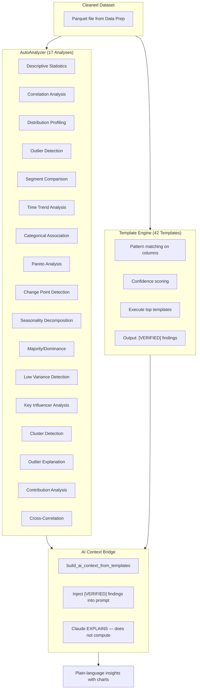
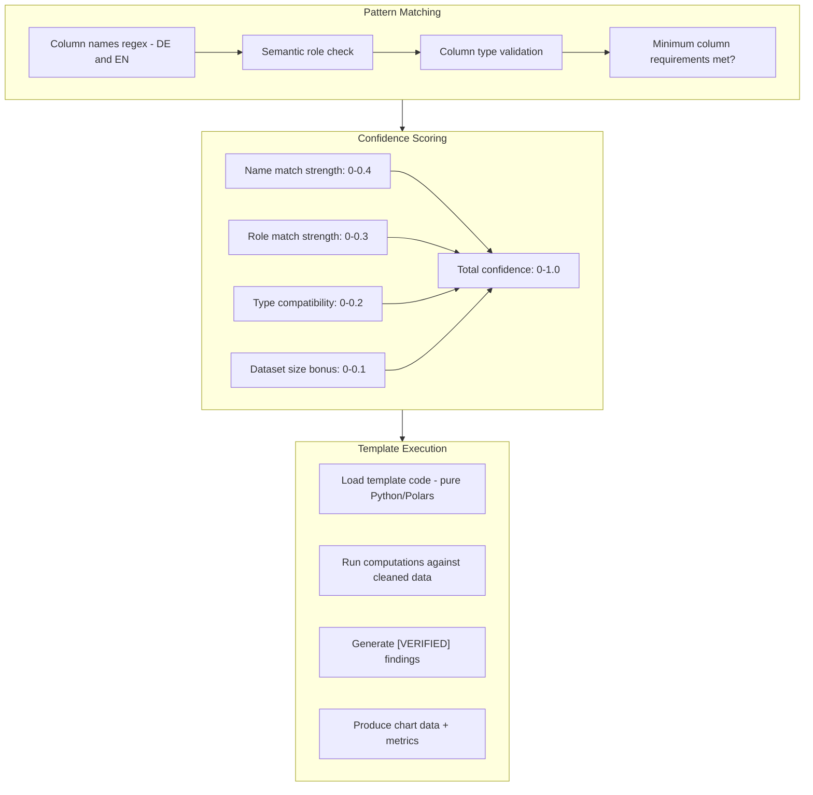
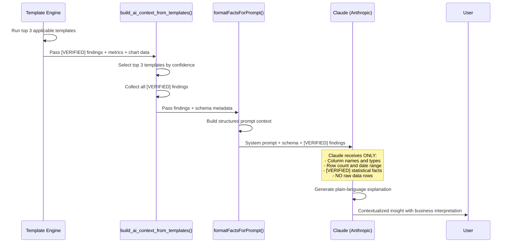

The Insights Engine is the core of DataLaser and the clearest proof that this is **not an LLM wrapper**. This document traces every computation, from raw statistical analyses through template matching to AI-contextualized explanations.

The fundamental principle: **deterministic code computes facts; AI explains them.**

## Architecture Overview



## AutoAnalyzer: 17 Statistical Analyses

The AutoAnalyzer runs up to 17 analyses on every dataset, entirely in Python and Polars. Zero AI calls. Zero external APIs. Every number is computed by deterministic code.

Which analyses run depends on the column types and semantic roles present in the dataset. A dataset with no date column will skip time-series analyses; a dataset with no numeric columns will skip correlation analysis.

<Steps>
  <Step title="1. Descriptive Statistics">
    **Applies to:** All numeric columns

    Computes: mean, median, standard deviation, skewness, kurtosis, min, max, percentiles (5th, 25th, 50th, 75th, 95th).

    Skewness and kurtosis are critical for downstream decisions. They determine whether parametric or non-parametric methods are appropriate for other analyses.
  </Step>

  <Step title="2. Correlation Analysis">
    **Applies to:** Datasets with 2+ numeric columns

    Computes both **Pearson** (linear) and **Spearman** (monotonic) correlations for every numeric column pair. Each correlation includes a **p-value** for significance testing.

    Results are filtered to surface only statistically significant correlations (p < 0.05) with absolute correlation > 0.3. Trivially obvious correlations (e.g., `price` vs. `total_price`) are suppressed using semantic role awareness.
  </Step>

  <Step title="3. Distribution Profiling">
    **Applies to:** All numeric columns

    Runs normality tests (Shapiro-Wilk for n < 5000, D'Agostino-Pearson for larger datasets) and classifies each column's distribution shape:

    | Shape | Detection Criteria |
    |-------|-------------------|
    | Normal | Shapiro-Wilk p > 0.05 |
    | Right-skewed | Skewness > 1.0 |
    | Left-skewed | Skewness < -1.0 |
    | Bimodal | Hartigan's dip test p < 0.05 |
    | Uniform | Low kurtosis + near-zero skewness |
    | Heavy-tailed | Kurtosis > 7.0 |
  </Step>

  <Step title="4. Outlier Detection">
    **Applies to:** All numeric columns

    Three methods run in parallel, and outliers are flagged by consensus:

    1. **IQR method**: values outside 1.5x IQR bounds
    2. **Z-score method**: values with |z| > 3.0
    3. **Isolation Forest**: unsupervised anomaly detection for multivariate outliers

    A value flagged by 2+ methods is classified as a **strong outlier**. Values flagged by only one method are **weak outliers**. The output includes the specific values, their row indices, and which methods flagged them.
  </Step>

  <Step title="5. Segment Comparison">
    **Applies to:** Datasets with 1+ categorical dimension and 1+ numeric measure

    Runs **one-way ANOVA** to test whether the mean of a numeric measure differs significantly across categories. For significant results (p < 0.05), **Tukey's HSD post-hoc test** identifies which specific category pairs differ.

    Example output: "Mean revenue differs significantly across regions (F=12.4, p=0.0003). Post-hoc: DACH is 34% higher than APAC (p=0.001)."
  </Step>

  <Step title="6. Time Trend Analysis">
    **Applies to:** Datasets with a date column and 1+ numeric measure

    Fits a **linear regression** (OLS) on the time series to detect overall trend direction and slope. Overlays **7-day and 30-day moving averages** to smooth noise.

    Reports: trend direction (increasing/decreasing/flat), slope magnitude, R-squared, and whether the trend is statistically significant (p < 0.05 on the slope coefficient).
  </Step>

  <Step title="7. Categorical Association">
    **Applies to:** Datasets with 2+ categorical columns

    Runs **chi-square test of independence** for each pair of categorical columns. For significant associations (p < 0.05), computes **Cramer's V** to measure effect size:

    | Cramer's V | Interpretation |
    |-----------|----------------|
    | < 0.1 | Negligible association |
    | 0.1 - 0.3 | Weak association |
    | 0.3 - 0.5 | Moderate association |
    | > 0.5 | Strong association |
  </Step>

  <Step title="8. Pareto Analysis">
    **Applies to:** Datasets with a categorical dimension and a numeric measure

    Tests whether the **80/20 rule** holds: do the top 20% of categories account for 80%+ of the total measure value?

    Computes the exact concentration ratio and identifies the specific categories in the "vital few." Output: "Top 4 products (18% of catalog) account for 82% of total revenue, a classic Pareto distribution."
  </Step>

  <Step title="9. Change Point Detection">
    **Applies to:** Time-series datasets with 50+ data points

    Uses the **PELT (Pruned Exact Linear Time)** algorithm to detect structural breaks in time series, points where the statistical properties (mean, variance) shift abruptly.

    Each detected change point includes: the date, the direction of change, the magnitude, and a confidence score.
  </Step>

  <Step title="10. Seasonality Decomposition">
    **Applies to:** Time-series datasets spanning 2+ seasonal cycles

    Applies **STL (Seasonal and Trend decomposition using Loess)** to separate the time series into three components:

    - **Trend**: long-term direction
    - **Seasonal**: repeating patterns (weekly, monthly, quarterly)
    - **Residual**: unexplained variation

    Reports the dominant seasonal period, seasonal amplitude, and trend-to-seasonal ratio.
  </Step>

  <Step title="11. Majority/Dominance Analysis">
    **Applies to:** All categorical columns

    Identifies columns where a single value dominates. Reports when the top value accounts for more than 50% of rows, or when the top 3 values account for more than 90%.

    This surfaces data imbalance that could bias downstream analysis.
  </Step>

  <Step title="12. Low Variance Detection">
    **Applies to:** All numeric columns

    Flags columns where the coefficient of variation (CV = std/mean) is below 0.01, meaning effectively constant values. These columns add no analytical value and are candidates for removal.
  </Step>

  <Step title="13. Key Influencer Analysis">
    **Applies to:** Datasets with a clear target measure and 3+ potential features

    Computes **feature importance** using a gradient boosted tree (LightGBM) trained to predict the target measure from all other columns. The top influencers are ranked by importance score.

    This answers: "Which columns have the strongest predictive relationship with [target]?"
  </Step>

  <Step title="14. Cluster Detection">
    **Applies to:** Datasets with 2+ numeric columns

    Runs **k-means clustering** with k=2 through k=8, using **silhouette scoring** to select the optimal k. If no k produces a silhouette score > 0.25, clustering is reported as "no natural clusters detected."

    For valid clusters: reports cluster count, sizes, centroids, and the most distinguishing features.
  </Step>

  <Step title="15. Outlier Explanation">
    **Applies to:** Datasets where Analysis #4 detected outliers

    For each strong outlier, provides **context**: the values of all other columns in that row, how each compares to the column median, and which combination of features makes this row unusual.

    This transforms a bare "row 4521 is an outlier" into "Row 4521: revenue of 142,000 is 12x the median, from customer Acme Corp, in region APAC, the only APAC transaction above 50,000."
  </Step>

  <Step title="16. Contribution Analysis">
    **Applies to:** Datasets with hierarchical dimensions (e.g., region > city, category > product)

    Decomposes a total metric change into segment-level contributions. If total revenue grew 15%, contribution analysis shows: "DACH contributed +12pp, APAC +5pp, Americas -2pp."

    Uses additive decomposition with proportional attribution.
  </Step>

  <Step title="17. Cross-Correlation">
    **Applies to:** Time-series datasets with 2+ numeric measures

    Computes **lagged correlations** between pairs of time series to detect lead-lag relationships. Tests lags from -30 to +30 periods.

    Example: "Marketing spend leads revenue by 14 days (cross-correlation: 0.72 at lag 14)."
  </Step>
</Steps>

## Template Engine: 42 Bilingual Templates

While the AutoAnalyzer runs generic statistical tests, the Template Engine applies **domain-specific intelligence**. Each template knows what to look for in a particular type of business data.

### How Template Matching Works



<Steps>
  <Step title="Pattern matching">
    Every template declares a set of **required column patterns**: regex patterns that must match at least one column name in the dataset, in both German and English.

    Example for template T09 (Umsatzanalyse / Revenue Analysis):

    ```python
    required_patterns = {
        "revenue": r"(?i)(umsatz|erlös|revenue|sales|income|einnahmen)",
        "dimension": r"(?i)(kunde|produkt|region|customer|product|category)"
    }
    ```

    The matcher tests every column name against every pattern. A template is **applicable** if all required patterns match at least one column.
  </Step>

  <Step title="Confidence scoring">
    Applicable templates receive a confidence score from 0.0 to 1.0, computed as:

    | Component | Weight | How It Scores |
    |-----------|--------|--------------|
    | Name match strength | 0.4 | Exact match (e.g., "Umsatz") scores higher than partial (e.g., "monthly_revenue_adjusted") |
    | Semantic role match | 0.3 | Profile-detected roles align with template expectations |
    | Type compatibility | 0.2 | Column dtypes match what the template needs (numeric for measures, string for dimensions) |
    | Dataset size bonus | 0.1 | Datasets with 100+ rows score higher (more statistical power) |

    Templates are ranked by confidence. Only templates with confidence > 0.5 are considered applicable.
  </Step>

  <Step title="Template execution">
    Each template contains **pure Python/Polars code**, with no AI calls. The code runs against the cleaned dataset and computes domain-specific metrics.

    Templates produce three types of output:

    1. **`[VERIFIED]` findings**: specific, quantified facts with exact numbers
    2. **Chart data**: pre-computed arrays for Recharts visualization
    3. **Metrics**: key-value pairs for summary display
  </Step>
</Steps>

### Template Example: T09 Umsatzanalyse

To illustrate the full template pipeline, here is how T09 (Revenue Analysis) works end-to-end:

<Steps>
  <Step title="Detection">
    T09's pattern matcher finds column `Umsatz` (matches `(?i)umsatz`) and column `Produkt` (matches `(?i)produkt`). Confidence: 0.88.
  </Step>

  <Step title="Computation">
    T09 executes pure Polars code:

    - **Top products**: Group by `Produkt`, sum `Umsatz`, rank descending
    - **Growth rates**: If a date column exists, compute period-over-period growth
    - **Concentration risk**: Compute HHI (Herfindahl-Hirschman Index) and top-N share
    - **Distribution**: Revenue by quartile across products
  </Step>

  <Step title="Output">
    ```
    [VERIFIED] Top 3 customers account for 67% of Umsatz — Klumpenrisiko
    [VERIFIED] Product "Maschinenteile A" generates 142,350 EUR (23% of total)
    [VERIFIED] Revenue growth: +8.2% QoQ, driven by DACH region (+14.3%)
    [VERIFIED] HHI = 0.18 — moderate concentration, top-heavy distribution
    ```

    Each finding is tagged `[VERIFIED]` because it was computed by deterministic code with exact numbers, not estimated, not hallucinated, not approximated by an LLM.
  </Step>
</Steps>

<Warning>
  The `[VERIFIED]` tag is a contract: every number following it was computed by template code running against real data. If a finding cannot be verified (e.g., insufficient data), it is either omitted or tagged `[ESTIMATE]` with a confidence interval.
</Warning>

## The AI Context Bridge

This is the critical architectural decision that separates DataLaser from LLM wrappers. The AI does not analyze data. It **explains pre-computed facts**.



<Steps>
  <Step title="build_ai_context_from_templates()">
    This function orchestrates the bridge:

    1. Calls `get_applicable()` to find all matching templates
    2. Selects the **top 3** by confidence score
    3. Executes each template's computation code
    4. Collects all `[VERIFIED]` findings, metrics, and chart data
    5. Passes everything to `formatFactsForPrompt()`
  </Step>

  <Step title="formatFactsForPrompt()">
    Structures the context for Claude's system prompt:

    ```
    ## Dataset Schema
    - 15 columns, 24,831 rows
    - Date range: 2023-01-01 to 2025-12-31
    - Columns: Umsatz (float, measure:revenue), Produkt (string, dimension:product), ...

    ## Verified Findings
    [VERIFIED] Top 3 customers account for 67% of Umsatz — Klumpenrisiko
    [VERIFIED] Revenue growth: +8.2% QoQ, driven by DACH region (+14.3%)
    [VERIFIED] 4 outlier transactions detected (>3x IQR), all from customer "Mega Corp"
    [VERIFIED] Seasonal pattern: Q4 revenue is 2.3x Q1 average (holiday effect)
    ...
    ```

    What is NOT included: raw data rows, individual record values, personally identifiable information.
  </Step>

  <Step title="Claude explains verified facts">
    Claude receives the structured context and generates:

    - **Plain-language summaries**: translating statistical findings into business language
    - **Priority ranking**: which findings matter most for the business
    - **Contextual interpretation**: what the numbers mean in a business context
    - **Recommended actions**: what the user should investigate further

    Claude's instructions explicitly state: "Do not compute, estimate, or infer any numbers. Only reference the [VERIFIED] findings provided. If you need a number that is not in the findings, say so."
  </Step>
</Steps>

<Info>
  This architecture means every AI-generated insight is **traceable**. If a user asks "where did this number come from?", the answer is always: "Template T09, line 47, computed as `df.group_by('Produkt').agg(pl.col('Umsatz').sum())`." There is a deterministic code path from raw data to every number in every insight.
</Info>

## How the Three Layers Work Together

| Layer | What It Does | AI Involved? | Output |
|-------|-------------|-------------|--------|
| AutoAnalyzer | 17 generic statistical tests | No | Raw statistical results (correlations, distributions, clusters, etc.) |
| Template Engine | 42 domain-specific analyses | No | `[VERIFIED]` findings with exact numbers, chart data, metrics |
| AI Context Bridge | Explains findings in business language | Yes (Claude) | Plain-language summaries, priorities, recommendations |

The AI layer is intentionally the **thinnest** layer. It adds natural language fluency and business context but contributes zero mathematical computation. Remove the AI layer and you still have every number, every chart, every finding. Add the AI layer back and you get human-readable explanations that are fully grounded in verified facts.

## What Happens Next

The Insights Engine feeds directly into the interactive analysis modes:

<CardGroup cols={2}>
  <Card title="Ask Data" icon="message-dots" href="/architecture/ask-and-studio">
    Users ask questions in natural language. The same template engine and AI context bridge power every answer.
  </Card>
  <Card title="Studio" icon="notebook" href="/architecture/ask-and-studio">
    Professional notebooks that chain template-powered analyses into comprehensive reports.
  </Card>
</CardGroup>
