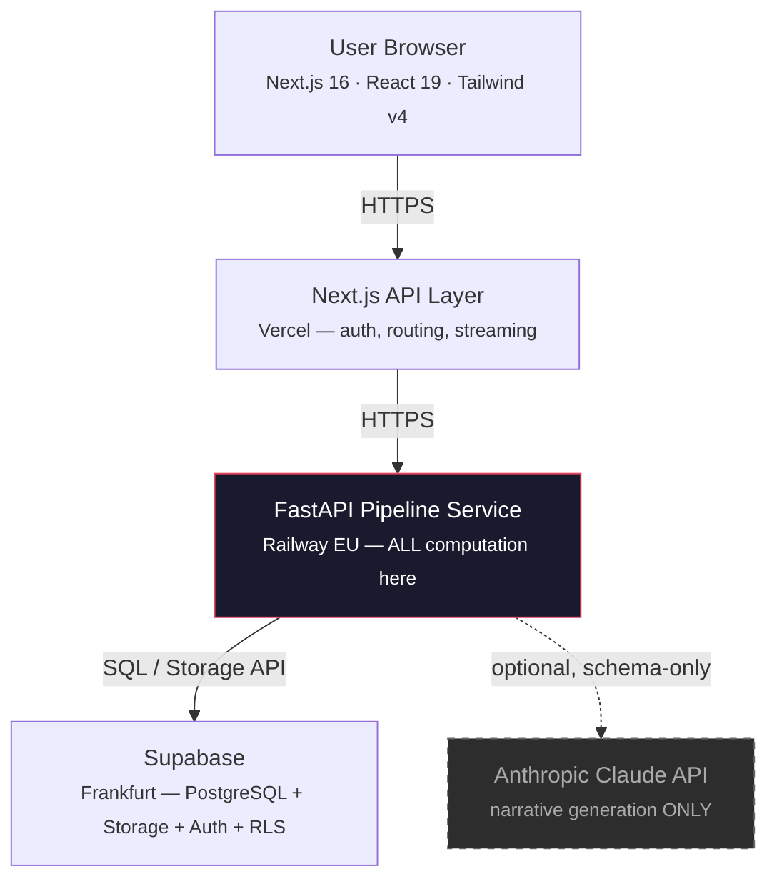

## Architecture Philosophy

DataLaser is a **complete analytics engine**. AI is an enhancement layer, not the core.

This distinction matters. Most products marketed as "AI analytics" are thin wrappers around an LLM. They send your data to a model, hope for the best, and present whatever comes back. DataLaser is architecturally different: the platform **computes, verifies, and validates** before AI ever touches anything.

<Warning>
  If Anthropic goes down tomorrow, DataLaser still works. Every template, every profiler run, every transformation, every validation check, and every auto-analysis executes on our own FastAPI pipeline engine. AI adds narrative generation on top of verified results. It does not produce those results.
</Warning>

Here is what runs entirely without AI:

- **42 industry templates** with bilingual (DE/EN) pattern matching
- **17 statistical analyses**: correlations, distributions, anomalies, trends, segmentation, and more
- **Data profiler**: completeness, type detection, cardinality, outlier detection
- **Transformer**: 16 operations including normalization, binning, date extraction, encoding
- **Validator**: 8 categories of data quality checks
- **Pipeline orchestrator**: end-to-end file ingestion through to insight generation
- **Sandboxed code execution**: user-submitted code runs in a restricted environment

AI's single job: take the `[VERIFIED]` findings these systems produce and write a clear, contextualized narrative explanation. That is it.

---

## System Components

The platform is composed of five layers. Every request flows top-to-bottom, with computation concentrated in the Pipeline Engine, not in an LLM.

<Info>
  The dashed line to Claude is intentional. The AI layer is optional. Every core pipeline step completes without it. The solid lines represent hard dependencies.
</Info>

### 1. Frontend

<Card title="Next.js 16 / React 19 Application" icon="browser">
  The client application runs on **Next.js 16** with **React 19**, **TypeScript**, and **Tailwind CSS v4**. UI components are built on **shadcn/ui** with **Motion** (Framer Motion) animations. Charts use **Recharts**. Internationalization is handled by **next-intl** with full German and English support.

  The frontend is a presentation and interaction layer only. It does not perform computation. It delegates everything to the API layer and renders results.
</Card>

### 2. API Gateway

<Card title="Next.js API Routes on Vercel" icon="server">
  Next.js API routes act as a thin proxy between the browser and the pipeline service. They handle:

  - **Authentication**: Supabase JWT verification on every request
  - **Request routing**: forwarding pipeline calls to the FastAPI service
  - **Response streaming**: SSE streaming for long-running analysis jobs
  - **File uploads**: proxying uploads to Supabase Storage with signed URLs

  The API gateway contains no business logic. It authenticates, routes, and streams.
</Card>

### 3. Pipeline Engine (the core)

<Card title="FastAPI Python Service on Railway EU" icon="gears">
  This is where DataLaser lives. The pipeline engine is a **FastAPI** service deployed on **Railway (EU region)** that handles every piece of computation:

  - **Polars** for high-performance file parsing and large dataset operations
  - **pandas + scipy + statsmodels + scikit-learn** for statistical analysis
  - **42 industry templates** with bilingual pattern matching (German and English column names, values, formats)
  - **17 auto-analyses**: correlation, distribution, anomaly detection, trend analysis, segmentation, regression, and more
  - **Data profiler**: type inference, completeness scoring, cardinality analysis, outlier detection
  - **Transformer**: 16 operations (normalization, binning, date extraction, one-hot encoding, etc.)
  - **Validator**: 8 categories of data quality rules
  - **Sandboxed code execution**: `os`, `subprocess`, and network modules are blocked; 30-second timeout enforced

  Every finding produced by this engine carries a `[VERIFIED]` tag, meaning it was computed deterministically, not guessed by a language model.
</Card>

### 4. Database

<Card title="Supabase PostgreSQL in Frankfurt" icon="database">
  All persistent state lives in **Supabase PostgreSQL** hosted in **Frankfurt (eu-central-1)**:

  - **22 migration files** managing schema evolution
  - **Row Level Security (RLS)** on every table, so users can only access their own data
  - **Supabase Auth** for user management and JWT issuance
  - **Supabase Storage** for uploaded files with signed URL access
  - Multi-tenant data isolation at the database level via RLS policies
</Card>

### 5. AI Layer

<Card title="Claude Sonnet: Narrative Generation Only" icon="wand-magic-sparkles">
  The Anthropic Claude API is used for exactly two things:

  1. **Narrative generation**: transforming verified statistical findings into plain-language explanations
  2. **Code suggestions**: proposing analysis code in the Studio notebook environment

  Claude receives **column names and `[VERIFIED]` findings only**, never raw data rows. The AI layer is structurally prevented from fabricating numbers because it never sees the numbers in the first place. It explains pre-computed facts.
</Card>

<Note>
  The AI layer is the only component with a dashed dependency line in the architecture diagram. If the Claude API is unavailable, DataLaser continues to compute, profile, transform, validate, and analyze data. Users see verified findings without narrative explanations until the API recovers.
</Note>

---

## What Makes This Not a Wrapper

The term "AI wrapper" describes a product that sends user input to an LLM and returns the response with minimal processing. DataLaser is the opposite. It has a full computation engine, and AI is a presentation layer on top.

| Capability | AI Wrapper | DataLaser |
|---|---|---|
| **Own computation engine** | No, relies on LLM | Yes: FastAPI + Polars + scipy |
| **Works without AI** | No, product is the AI | Yes: 42 templates + 17 analyses |
| **Verified results** | No, AI guesses at data | Yes: `[VERIFIED]` tag on every finding |
| **Data pipeline** | No, raw data to LLM | Yes: 5-step wizard (Profile, Transform, Validate, Analyze, Explain) |
| **Industry templates** | No, generic prompts | Yes: 42 bilingual templates with domain-specific metrics |
| **Code execution sandbox** | No | Yes: blocked `os`/`subprocess`, 30s timeout |
| **Live database connections** | No, upload only | Yes: PostgreSQL, MySQL, Snowflake, and more |
| **Data never sent to AI** | No, raw data goes to LLM | Yes: only column names + computed statistics reach Claude |
| **Deterministic outputs** | No, same question, different answer | Yes: same data, same template, same result every time |

<Tip>
  A simple test: disconnect the AI. If the product stops working, it is a wrapper. DataLaser passes this test. Every core capability runs on our own engine.
</Tip>

---

## Technology Stack

The complete technology stack, organized by layer:

### Frontend

| Technology | Version | Purpose |
|---|---|---|
| Next.js | 16 | React framework, App Router, server components |
| React | 19 | UI rendering, concurrent features |
| TypeScript | 5.x | Type safety across the entire frontend |
| Tailwind CSS | v4 | Utility-first styling |
| shadcn/ui | latest | Accessible, composable UI component library |
| Recharts | 2.x | Chart and visualization rendering |
| Motion (Framer Motion) | latest | Animation and transitions |
| next-intl | latest | Internationalization (German / English) |

### API Gateway

| Technology | Purpose |
|---|---|
| Next.js API Routes | Request routing, auth middleware, SSE streaming |
| Vercel | Hosting, edge functions, CDN |
| Supabase JS Client | JWT verification, storage operations |

### Pipeline Engine

| Technology | Purpose |
|---|---|
| FastAPI | Async Python web framework for the pipeline service |
| Polars | High-performance DataFrame library for large file parsing |
| pandas | Data manipulation for analysis pipelines |
| scipy | Statistical tests and distributions |
| statsmodels | Time series analysis, regression diagnostics |
| scikit-learn | Clustering, segmentation, anomaly detection |
| Python `ast` module | Sandboxed code execution (AST-level blocking) |

### Database and Storage

| Technology | Purpose |
|---|---|
| PostgreSQL (Supabase) | Primary database, Frankfurt region |
| Supabase Auth | User authentication, JWT issuance |
| Supabase Storage | File storage with signed URL access |
| Row Level Security | Tenant isolation at the database level |

### AI Layer

| Technology | Purpose |
|---|---|
| Anthropic Claude (Sonnet) | Narrative generation from verified findings |
| Streaming (SSE) | Real-time delivery of AI-generated explanations |

### Infrastructure

| Technology | Purpose |
|---|---|
| Vercel | Frontend and API gateway hosting |
| Railway (EU) | Pipeline engine hosting (EU region) |
| Supabase (Frankfurt) | Database and storage hosting (eu-central-1) |

<CardGroup cols={2}>
  <Card title="Security Architecture" icon="shield-halved" href="/security/overview">
    How DataLaser protects your data at every layer: RLS, signed URLs, JWT verification, and EU data residency.
  </Card>
  <Card title="Data Flow" icon="arrow-right-arrow-left" href="/security/data-flow">
    Detailed walkthrough of how data moves through the system, from upload to insight.
  </Card>
  <Card title="Pipeline API" icon="code" href="/api-reference/pipeline">
    Technical API reference for the pipeline engine endpoints.
  </Card>
  <Card title="Templates" icon="industry" href="/guides/templates">
    Deep dive into the 42 industry templates and how pattern matching works.
  </Card>
</CardGroup>
