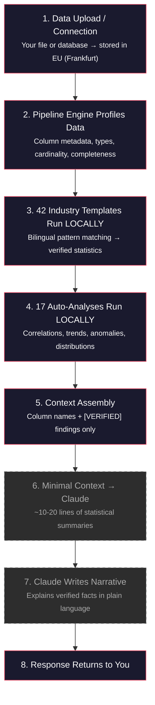

## The Core Principle: Zero Data Exposure

<Warning>
  DataLaser's AI layer (Claude) **NEVER** receives your actual data. Not a single row. Not a single value. Not a single customer name. This is not a policy. It is an **architectural constraint enforced in code**.
</Warning>

All computation happens on DataLaser's own pipeline engine, a FastAPI service running in the EU (Frankfurt). The AI receives **only**:

- Table and column names
- Data types
- Row counts
- Pre-computed, aggregated statistical summaries marked `[VERIFIED]`

There is no configuration that changes this. There is no flag that sends more. The function that assembles the AI payload structurally excludes raw data. An engineer would have to rewrite core infrastructure to change this behavior.

<CardGroup cols={2}>
  <Card title="Your Data" icon="database">
    Stays in EU infrastructure (Frankfurt). Processed by DataLaser's own engine. Never leaves your region.
  </Card>
  <Card title="What AI Receives" icon="message-lines">
    Column names, data types, row counts, and `[VERIFIED]` statistical summaries. That is everything. That is the maximum.
  </Card>
</CardGroup>

---

## What Gets Sent to AI: The Exact Payload

Transparency matters. Here is a concrete example of what Claude actually receives when processing a customer dataset:

```text What AI sees
Dataset: orders_2024.csv
Columns: order_id (id), customer_name (categorical), product (categorical),
         revenue (numeric), order_date (date), region (categorical)
Row count: 12,847
Date range: 2024-01-01 to 2024-12-31

[VERIFIED] Top 3 products account for 62.4% of total revenue
[VERIFIED] Revenue grew 18.4% MoM in Q4 vs Q3
[VERIFIED] North region outperforms South by 2.3x in average order value
[VERIFIED] 3 customers represent 41% of revenue — concentration risk detected

User question: "Which products are driving growth?"
```

That is it. Column names, types, counts, and pre-computed statistics. Now here is what AI **never** sees:

```text What AI NEVER sees
❌ "John Smith ordered €4,500 on 2024-03-15"
❌ "Acme Corp, invoice #INV-2024-0847, €12,300"
❌ Raw CSV rows or database records
❌ Customer names, emails, addresses
❌ Transaction amounts or individual values
❌ Any personally identifiable information
```

<Tip>
  You can audit exactly what was sent to AI for every interaction. The assembled payload is logged and available in your project's activity log. There are no hidden transmissions.
</Tip>

---

## How This Works, Step by Step

Every request follows the same path. AI is involved in exactly one step, the last one, and it receives only the minimal context assembled by the steps before it.



<Info>
  At step 6, the data has been reduced from potentially **millions of rows** to approximately **10-20 lines** of statistical summaries. No individual records exist in what AI receives. The solid-colored steps run entirely on DataLaser's own infrastructure. The dashed steps involve the AI layer.
</Info>

**Steps 1-5 run on DataLaser's own engine.** Steps 6-7 involve Claude. Step 8 returns to you. If Claude is unavailable, steps 1-5 still complete. You get every verified finding, every chart, every profiling result. Only the narrative explanation pauses.

---

## The buildDataContext() Function

This is the architectural constraint in code. The function that assembles what AI receives is structurally incapable of including raw data:

```typescript
function buildDataContext(source) {
  return `
    Dataset: ${source.name}
    Row count: ${source.row_count}
    Columns: ${columns.map(c => `${c.name}: ${c.dtype}`).join(', ')}
    Date range: ${dateRange}
    ${verifiedFindings.map(f => `[VERIFIED] ${f}`).join('\n')}
  `
  // ⛔ source.rows is NEVER included
  // ⛔ source.sample_data is NEVER included
  // ⛔ Individual values are NEVER included
}
```

<Note>
  This function does not have a parameter to include raw data. It cannot be called with a flag that changes this behavior. The only inputs are metadata and pre-computed aggregated findings. This is a **design constraint**, not a runtime check.
</Note>

---

## What Happens If AI Goes Down?

DataLaser continues to work. This is the clearest proof that AI is an enhancement layer, not the product.

<CardGroup cols={2}>
  <Card title="Still Works Without AI" icon="check">
    - All 42 industry templates
    - All 17 statistical analyses
    - Data profiling and type detection
    - Data transformation (16 operations)
    - Data validation (8 rule categories)
    - Charts and visualizations
    - Sandboxed code execution
  </Card>
  <Card title="Pauses Without AI" icon="pause">
    - Narrative explanations of findings
    - Natural language Q&A (Ask Data)
    - AI-suggested code in Studio
    - Plain-language insight summaries
  </Card>
</CardGroup>

<Warning>
  This is fundamentally different from AI wrappers. If an AI wrapper loses its AI provider, the product is completely non-functional. There is nothing else. DataLaser's core is a computation engine. AI adds a presentation layer on top of verified results.
</Warning>

---

## Code Execution Sandbox

When AI suggests code (in Studio or Ask Data), that code executes in DataLaser's pipeline sandbox, never on AI's servers.

| Safeguard | Detail |
|---|---|
| **Execution environment** | DataLaser's Pipeline Engine sandbox (Railway EU) |
| **Blocked modules** | `os`, `subprocess`, `sys`, `importlib`, `shutil`, `socket` |
| **Execution timeout** | 30 seconds maximum |
| **Memory limits** | Enforced per execution |
| **Network access** | Blocked. No outbound connections from sandbox |
| **What returns to AI** | Only aggregated results for explanation |
| **Raw data** | Stays in the sandbox, never leaves |

<Info>
  Code is parsed at the AST level before execution. Blocked modules are caught before a single line runs, not at runtime, but at parse time. There is no way to import a restricted module through aliasing or dynamic imports.
</Info>

---

## GDPR / DSGVO Compliance Summary

DataLaser is built for the European market. GDPR compliance is not a retrofit. It is the foundation.

| Requirement | Implementation |
|---|---|
| **Data residency** | All infrastructure in EU (Frankfurt + EU West) |
| **Legal basis** | Art. 6(1)(b) GDPR, contract performance |
| **Data minimization** | Architecturally enforced. AI receives only metadata + aggregated statistics |
| **Sub-processors** | Supabase (Frankfurt), Railway (EU), Anthropic (DPA with EU SCCs) |
| **Anthropic commitments** | Data not used for training, SOC 2 Type II, processing only for service delivery |
| **Right to deletion** | Full data purge within 30 days on request |
| **AVV / DPA** | Available on request for all plans |
| **Data processing records** | Maintained per Art. 30 GDPR |

<Tip>
  **For German organizations (DSGVO):** An Auftragsverarbeitungsvertrag (AVV) is available on request. All sub-processors maintain DPAs with EU Standard Contractual Clauses. Anthropic's processing agreement explicitly states that customer data is not used for model training.
</Tip>

---

## Enterprise Privacy Mode

For organizations that require **absolute zero external data transfer**, with no exceptions, no AI, no external API calls.

<Card title="Enterprise Privacy Mode" icon="shield-check">
  Enable in **Project Settings → Privacy**. When activated:

  - All **42 industry templates** still run (pure local computation)
  - All **17 statistical analyses** still run (correlations, trends, anomalies)
  - All profiling, transformation, and validation still works
  - AI narrative generation is **disabled**
  - **Zero bytes** are sent outside EU infrastructure
  - No API calls to Anthropic or any external AI service

  Available on the **Enterprise plan**.
</Card>

<Note>
  Enterprise Privacy Mode does not degrade the analytical capabilities of the platform. Every computation, every template, every statistical test runs exactly as it does in standard mode. The only difference is that findings are presented as structured data and charts rather than AI-generated narrative text.
</Note>

---

## How DataLaser Compares

This table compares DataLaser's privacy architecture against typical AI analytics tools and ChatGPT-based wrappers.

| Capability | ChatGPT / AI Wrappers | DataLaser |
|---|---|---|
| **Sees your raw data** | Yes, full rows sent to AI | No, only column names + aggregated stats |
| **Works without AI** | No, completely broken | Yes: 42 templates + 17 analyses |
| **Data leaves your region** | Often, to US servers | Never. EU infrastructure only |
| **Computation engine** | None. AI does everything | Own FastAPI engine (Polars, scipy, statsmodels) |
| **Results verified** | No, AI guesses | Yes: `[VERIFIED]` tag on every finding |
| **GDPR compliant** | Often unclear | Yes: EU infrastructure + DPA + AVV |
| **Can audit what AI received** | No | Yes: exact payload logged and auditable |
| **Enterprise air-gap mode** | No | Yes: zero external data transfer option |
| **Data used for AI training** | Often yes, or unclear | No, contractually and architecturally prevented |

---

## Summary

<CardGroup cols={3}>
  <Card title="Zero Data Exposure" icon="eye-slash">
    AI receives column names and aggregated statistics. Never raw data. Never individual records. Never PII.
  </Card>
  <Card title="EU Only" icon="flag">
    All infrastructure runs in Frankfurt and EU West. Data never leaves the European Union.
  </Card>
  <Card title="Auditable" icon="magnifying-glass">
    Every AI payload is logged. You can inspect exactly what was sent, when, and for which query.
  </Card>
</CardGroup>

<Tip>
  **Questions about our privacy architecture?** Contact [privacy@datalaser.de](mailto:privacy@datalaser.de) or request a technical deep-dive with our engineering team. We are happy to walk through the code with your security team.
</Tip>
