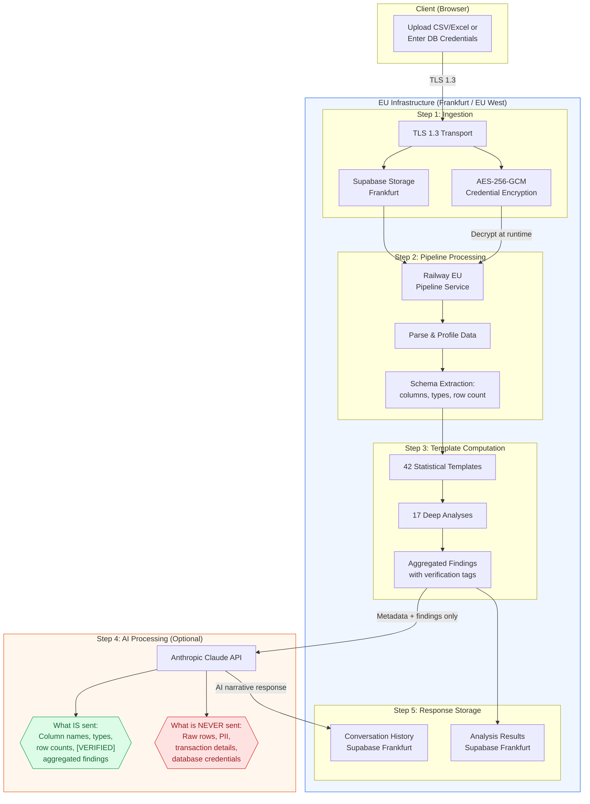
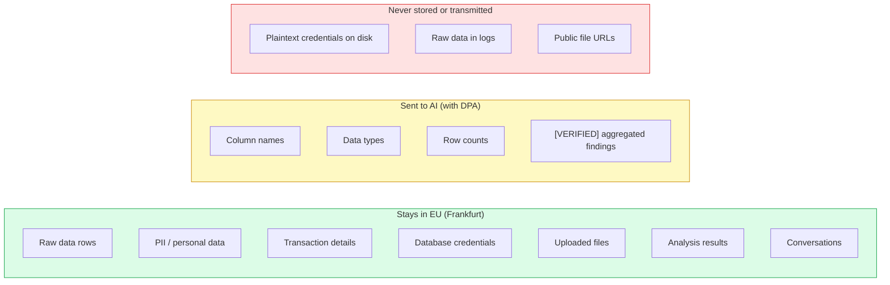

# Data Flow Architecture

DataLaser processes your data through five distinct stages. At each stage, we apply the principle of **data minimization**: only the minimum information required for the next step is passed forward.

<Info>
  The key architectural guarantee: **raw data rows never leave the EU pipeline service.** AI receives only structural metadata and pre-verified aggregated findings.
</Info>

---

## End-to-End Flow Diagram

---

## Step 1: Upload & Connect

<Card title="Data Ingestion" icon="upload">

**File Upload (CSV, Excel)**
- Files are transmitted from the browser to the API over **TLS 1.3**.
- Files are stored in **Supabase Storage in Frankfurt** (eu-central-1).
- Access is controlled via **signed URLs with 1-hour expiry**. No public file URLs exist.
- Files are encrypted at rest using Supabase's server-side encryption.

**Database Connection**
- Database credentials are transmitted over **TLS 1.3**.
- Before storage, credentials are encrypted with **AES-256-GCM** using a server-side encryption key.
- Only the encrypted ciphertext is persisted in Supabase (Frankfurt).
- The plaintext credential never touches disk, logs, or any persistent storage.

</Card>

<Warning>
  Database credentials are decrypted **only** at runtime inside the pipeline service. The encryption key is managed as a server-side environment secret and is never exposed to client code.
</Warning>

---

## Step 2: Pipeline Processing

<Card title="Compute in Railway EU" icon="microchip">

All data processing runs on **Railway's EU infrastructure**:

- **Data parsing.** CSV/Excel files are read and validated. Database connections are established using decrypted credentials.
- **Schema extraction.** Column names, data types, and row counts are captured.
- **Data profiling.** Statistical properties are computed: distributions, null rates, cardinality, outliers.
- **All computation is local.** No data leaves the Railway EU compute environment during this step.

After profiling, the pipeline produces a structured schema summary and statistical profile. The raw data rows are consumed and processed entirely within this step.

</Card>

---

## Step 3: Template Computation

<Card title="42 Templates + 17 Analyses" icon="calculator">

DataLaser includes a library of deterministic statistical templates:

- **42 templates** covering distributions, correlations, time-series patterns, segmentation, anomaly detection, and more.
- **17 deep analyses** for advanced statistical methods including regression diagnostics, cohort analysis, and predictive modeling.

**Zero external API calls.** Every template runs as local computation inside the EU pipeline service. Results are tagged with `[VERIFIED]` markers to indicate they are computed facts, not AI-generated claims.

</Card>

<Tip>
  In **Enterprise Privacy Mode**, the data flow stops here. All 42 templates and 17 analyses produce complete analytical results without any AI involvement. No data, not even metadata, is sent externally.
</Tip>

---

## Step 4: AI Processing

This step is **optional** and only occurs when AI-powered narrative insights are requested (and Enterprise Privacy Mode is not enabled).

### What IS Sent to Anthropic Claude

| Data Category | Example |
|---|---|
| Column names | `revenue`, `customer_id`, `order_date` |
| Data types | `numeric`, `text`, `timestamp` |
| Row counts | `45,231 rows` |
| `[VERIFIED]` aggregated findings | `Mean revenue: 12,450. Median: 9,800. Top segment: Enterprise (38%).` |

### What is NEVER Sent to Anthropic Claude

| Data Category | Guarantee |
|---|---|
| Raw data rows | Architecturally blocked; pipeline outputs only aggregations |
| Individual PII | No names, emails, addresses, phone numbers, IDs |
| Transaction details | No individual orders, payments, or line items |
| Database credentials | Never leave the pipeline service |
| File contents | Raw files stay in Supabase Storage |

<Warning>
  This separation is **architectural, not policy-based**. The AI integration layer physically cannot access raw data rows. It receives only the structured output of the template computation stage.
</Warning>

### How It Works

1. The pipeline produces a **findings payload**: column names, types, row counts, and `[VERIFIED]` aggregated statistics.
2. This payload is sent to the Anthropic Claude API over **TLS 1.3**.
3. Claude generates a natural-language narrative interpreting the findings.
4. The narrative is returned to DataLaser and stored in **Supabase (Frankfurt)**.

Anthropic's data processing agreement (DPA) with EU Standard Contractual Clauses (SCCs) governs this interaction. Anthropic does not use API inputs for model training.

---

## Step 5: Response & Storage

<Card title="Everything Stays in Frankfurt" icon="database">

All outputs are stored in Supabase (Frankfurt, eu-central-1):

- **Analysis results.** Template outputs, statistical findings, computed metrics.
- **Conversation history.** AI-generated narratives and user interactions.
- **Metadata.** Project structure, source configurations, user preferences.

All stored data is:
- Encrypted at rest (AES-256)
- Protected by Row-Level Security (organization isolation)
- Accessible only via authenticated, authorized API calls

</Card>

---

## Summary: Data Boundary Map

<Note>
  Questions about our data flow? Request a detailed architecture review at **security@datalaser.app**. We are happy to walk through the flow with your security team.
</Note>
