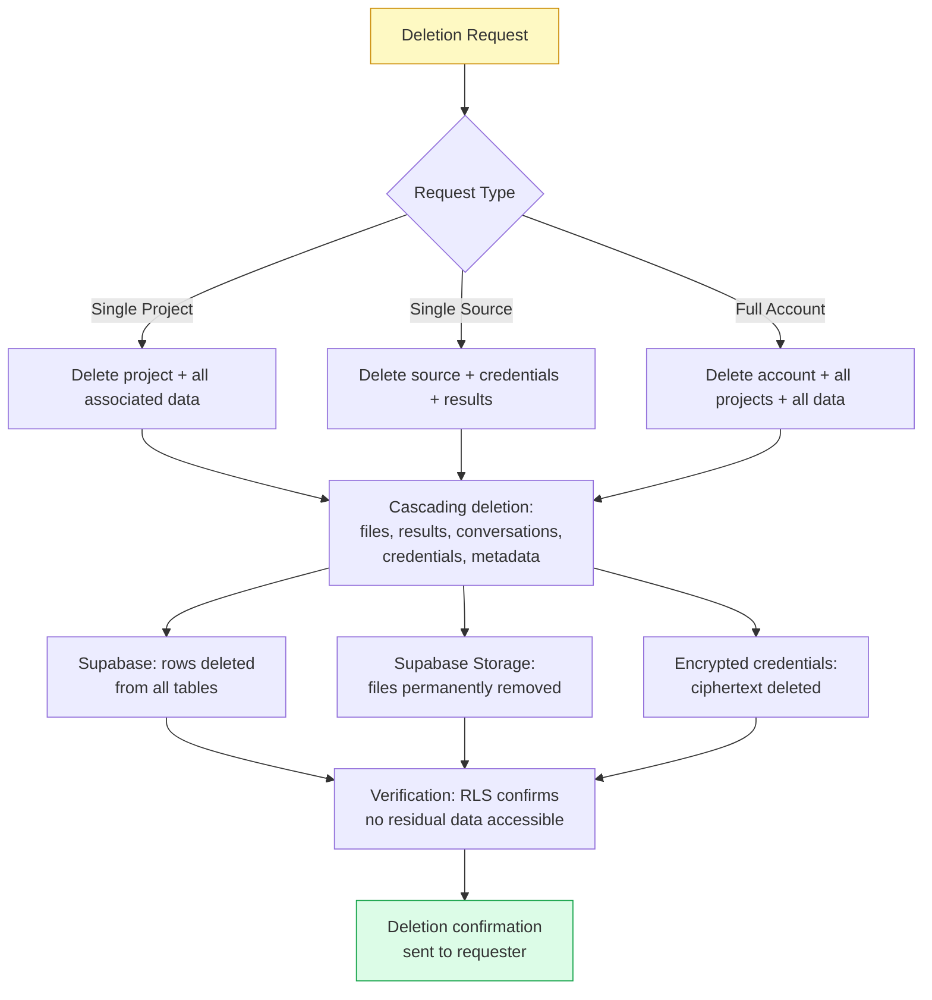

# DSGVO / GDPR Compliance

DataLaser is fully compliant with the **Datenschutz-Grundverordnung (DSGVO)**, the German implementation of the EU General Data Protection Regulation (GDPR). This page details our compliance measures for data protection officers, legal teams, and compliance auditors.

<Info>
  This page uses both German (DSGVO) and English (GDPR) terminology to support bilingual compliance documentation requirements common in German enterprises.
</Info>

---

## Rechtsgrundlage / Legal Basis for Processing

DataLaser processes personal data under the following legal bases per **Art. 6(1) DSGVO**:

<CardGroup cols={2}>
  <Card title="Art. 6(1)(b): Vertragserfullung" icon="file-contract" color="#2563EB">
    **Contract Performance.** Processing is necessary for the performance of the contract between DataLaser and the customer. This covers data ingestion, analysis, storage, and delivery of analytical results.
  </Card>
  <Card title="Art. 6(1)(f): Berechtigtes Interesse" icon="scale-balanced" color="#7C3AED">
    **Legitimate Interest.** Limited processing for platform security, fraud prevention, and service reliability. Balancing tests documented and available on request.
  </Card>
</CardGroup>

<Note>
  DataLaser acts as a **Auftragsverarbeiter (data processor)** on behalf of the customer (Verantwortlicher / data controller). The customer determines the purposes and means of processing for the data they upload or connect.
</Note>

---

## Datenminimierung / Data Minimization

Data minimization (Art. 5(1)(c) DSGVO) is a core architectural principle, not an afterthought:

### What the AI Receives

| Data Element | Sent to AI? | Justification |
|---|---|---|
| Column names | Yes | Required for contextual interpretation of findings |
| Data types | Yes | Required for appropriate statistical commentary |
| Row counts | Yes | Required for significance assessment |
| `[VERIFIED]` aggregated findings | Yes | Pre-computed statistics, no individual data points |
| **Raw data rows** | **Never** | Architecturally blocked |
| **Personal identifiers (PII)** | **Never** | Architecturally blocked |
| **Individual transaction records** | **Never** | Architecturally blocked |
| **Database credentials** | **Never** | Encrypted, decrypted only in pipeline |

### Local-Only Computation

- **42 statistical templates** execute entirely within EU infrastructure with zero external API calls.
- **17 deep analyses** run as local computation on Railway EU.
- **Enterprise Privacy Mode** eliminates all external AI interaction, ensuring complete data minimization.

<Warning>
  The AI never receives raw data. This is enforced by the system architecture: the AI integration layer only has access to the output of the template computation stage, which produces aggregated statistics. There is no code path that could transmit raw rows to any external service.
</Warning>

---

## Speicherbegrenzung / Storage Limitation

Per Art. 5(1)(e) DSGVO, personal data is kept only as long as necessary:

| Data Type | Retention | Deletion Trigger |
|---|---|---|
| Uploaded files | Duration of project lifecycle | Project deletion or account deletion |
| Analysis results | Duration of project lifecycle | Project deletion or account deletion |
| Conversation history | Duration of project lifecycle | Project deletion or account deletion |
| Database credentials (encrypted) | Until source disconnected or project deleted | Source removal or project deletion |
| User account data | Duration of contract | Account deletion request or contract termination |
| Server logs | 30 days | Automatic rotation |
| Anthropic API interactions | Not retained by Anthropic for training | Per Anthropic DPA |

<Tip>
  Customers can delete individual projects, sources, or their entire account at any time. Deletion is cascading: removing a project removes all associated files, results, conversations, and credentials.
</Tip>

---

## Betroffenenrechte / Data Subject Rights

DataLaser supports all data subject rights under Chapter III DSGVO:

<CardGroup cols={2}>
  <Card title="Auskunftsrecht (Art. 15)" icon="magnifying-glass">
    **Right of Access.** Data subjects can request a complete export of all personal data processed by DataLaser. We fulfill requests within 30 days.
  </Card>
  <Card title="Recht auf Loschung (Art. 17)" icon="trash">
    **Right to Erasure.** Data subjects can request deletion of their personal data. Deletion is cascading and covers all associated projects, files, results, and conversations.
  </Card>
  <Card title="Recht auf Datenubertragbarkeit (Art. 20)" icon="file-export">
    **Right to Data Portability.** Data subjects can export their data in structured, machine-readable formats (JSON, CSV).
  </Card>
  <Card title="Recht auf Berichtigung (Art. 16)" icon="pen">
    **Right to Rectification.** Data subjects can request correction of inaccurate personal data.
  </Card>
  <Card title="Recht auf Einschrankung (Art. 18)" icon="pause">
    **Right to Restriction.** Data subjects can request restricted processing while disputes are resolved.
  </Card>
  <Card title="Widerspruchsrecht (Art. 21)" icon="hand">
    **Right to Object.** Data subjects can object to processing based on legitimate interest. We cease processing unless compelling legitimate grounds override.
  </Card>
</CardGroup>

### How to Exercise Rights

Data subject requests can be submitted to:

- **Email:** privacy@datalaser.app
- **Response time:** Within 30 days (Art. 12(3) DSGVO)
- **Verification:** We verify the identity of the requester before processing any request
- **Format:** Responses provided in a structured, commonly used, machine-readable format where applicable

---

## Auftragsverarbeitungsvertrag (AVV) / Data Processing Agreement

Per **Art. 28 DSGVO**, DataLaser provides a comprehensive Auftragsverarbeitungsvertrag (AVV) that covers:

| AVV Section | Content |
|---|---|
| **Gegenstand und Dauer** | Subject matter, duration, nature, and purpose of processing |
| **Art der Daten** | Categories of personal data processed |
| **Betroffene Personen** | Categories of data subjects |
| **Technische und organisatorische Massnahmen (TOMs)** | Encryption, access control, RLS, sandboxing, signed URLs |
| **Unterauftragnehmer** | Complete sub-processor list with notification obligations |
| **Weisungsgebundenheit** | Processing only on documented instructions of the controller |
| **Vertraulichkeit** | Confidentiality obligations for all personnel |
| **Unterstutzungspflichten** | Assistance with data subject rights and DPIAs |
| **Loschung und Ruckgabe** | Data deletion and return upon contract termination |
| **Nachweispflichten** | Audit rights and compliance demonstration |

<Info>
  Our AVV is available in both **German** and **English**. Request it at **legal@datalaser.app**. We typically execute within 3 business days.
</Info>

---

## Unterauftragnehmer / Sub-Processors

Per Art. 28(2) DSGVO, we maintain a current list of sub-processors and provide advance notification of changes:

| Unterauftragnehmer | Funktion | Standort | Verarbeitete Daten |
|---|---|---|---|
| **Supabase** (AWS eu-central-1) | Datenbank, Authentifizierung, Dateispeicher | Frankfurt, DE | Alle Anwendungsdaten (verschlusselt, RLS-geschutzt) |
| **Anthropic** | KI-API (Claude) | USA (mit EU-Standardvertragsklauseln) | Nur Spaltennamen, Datentypen, Zeilenanzahl, aggregierte Ergebnisse |
| **Railway** | Pipeline-Verarbeitung | EU West | Daten im Arbeitsspeicher wahrend der Verarbeitung |
| **Vercel** | Anwendungs-Hosting, CDN | EU Edge | Anwendungscode, statische Inhalte |

### Guarantees for Sub-Processor Data Transfers

- **Supabase, Railway, Vercel.** All processing within the EU. No international data transfer.
- **Anthropic.** Data Processing Agreement with **EU Standard Contractual Clauses (SCCs)** per Art. 46(2)(c) DSGVO. Transfer Impact Assessment (TIA) completed. Only metadata and aggregated findings are transferred, never raw data or PII.

<Warning>
  Customers using **Enterprise Privacy Mode** have zero data transfer to Anthropic. In this configuration, the sub-processor list reduces to Supabase, Railway, and Vercel, all EU-only.
</Warning>

---

## Datenloscherfahren / Data Deletion Process

DataLaser implements a structured data deletion process:

**Deletion timeline:**
- **Immediate:** Data removed from application layer and inaccessible via API.
- **Within 30 days:** Data purged from all backups and redundant storage per Supabase retention policies.
- **Anthropic:** No raw data was ever sent, so no deletion request to Anthropic is necessary for raw data. Metadata interactions are not retained by Anthropic for training purposes.

---

## Technische und Organisatorische Massnahmen (TOMs)

Summary of key technical and organizational measures per Art. 32 DSGVO:

| Massnahme | Umsetzung |
|---|---|
| **Verschlusselung (Encryption)** | AES-256 at rest, TLS 1.3 in transit, AES-256-GCM for credentials |
| **Zugriffskontrolle (Access Control)** | Supabase RLS on all tables, organization-level isolation |
| **Pseudonymisierung** | AI receives only aggregated findings, no identifiable data |
| **Belastbarkeit (Resilience)** | Supabase managed backups, Railway auto-scaling |
| **Wiederherstellbarkeit (Recoverability)** | Point-in-time recovery via Supabase |
| **Regelmassige Uberprufung** | Continuous monitoring, dependency auditing |
| **Sandbox-Isolation** | Code execution blocks os, subprocess, sys, importlib; 30s timeout; memory limits |
| **Signierte URLs** | File access via 1-hour expiry signed URLs only |

---

## Datenschutzbeauftragter / Data Protection Contact

For all data protection inquiries, data subject requests, or to request our AVV:

<CardGroup cols={2}>
  <Card title="Datenschutzbeauftragter" icon="user-shield">
    **Data Protection Officer**

    Email: **dpo@datalaser.app**

    For data subject rights requests, DPIAs, and regulatory inquiries.
  </Card>
  <Card title="Security Team" icon="shield-halved">
    **Security & Compliance**

    Email: **security@datalaser.app**

    For security questionnaires, penetration test reports, and vendor assessments.
  </Card>
</CardGroup>

<Tip>
  German-language communication is fully supported. Alle Anfragen konnen auch auf Deutsch gestellt werden. Unser Datenschutzteam antwortet in der bevorzugten Sprache.
</Tip>
