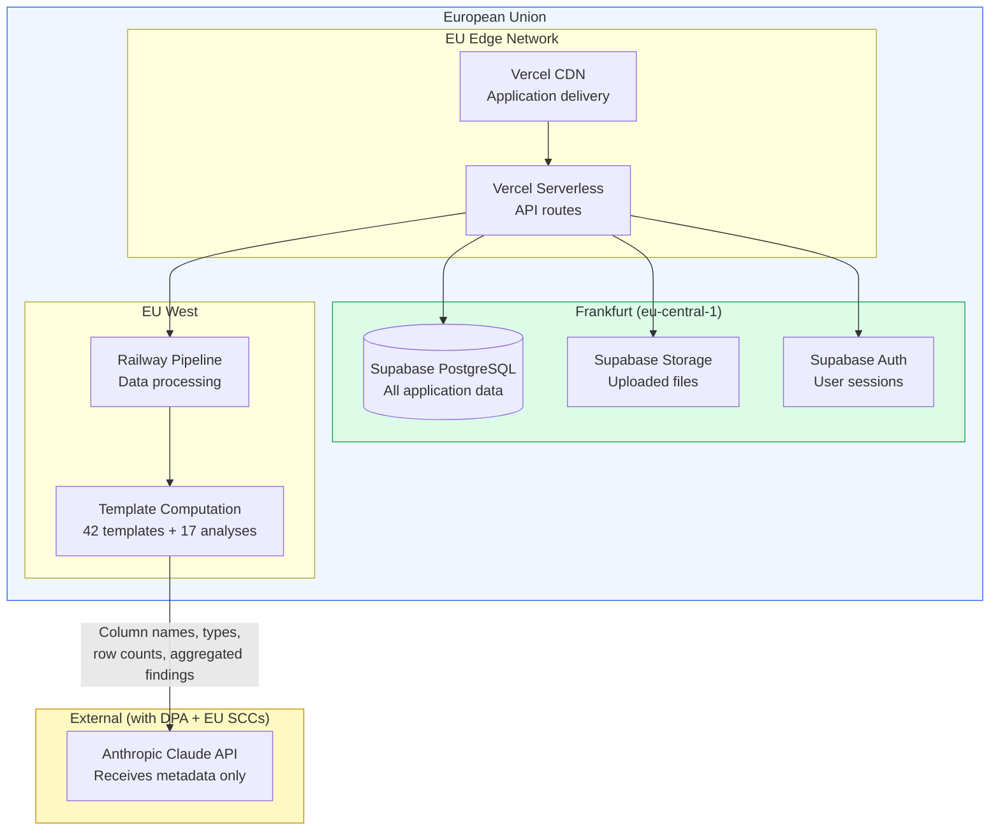

# EU Data Residency

DataLaser's entire infrastructure operates within the European Union. This is not a configuration option or an add-on. It is the default and only deployment model.

<CardGroup cols={3}>
  <Card title="Supabase Frankfurt" icon="database" color="#16A34A">
    **eu-central-1**
    Database, authentication, file storage, real-time subscriptions
  </Card>
  <Card title="Railway EU" icon="microchip" color="#2563EB">
    **EU West**
    Pipeline processing, data analysis, template computation
  </Card>
  <Card title="Vercel EU CDN" icon="globe" color="#7C3AED">
    **EU Edge**
    Application delivery, static assets, serverless functions
  </Card>
</CardGroup>

---

## Infrastructure Map



---

## What Stays in the EU

Every category of customer data is stored and processed exclusively within EU infrastructure:

| Data Category | Location | Leaves EU? |
|---|---|---|
| Uploaded files (CSV, Excel) | Supabase Storage, Frankfurt | No |
| Database credentials (encrypted) | Supabase DB, Frankfurt | No |
| Analysis results | Supabase DB, Frankfurt | No |
| Conversation history | Supabase DB, Frankfurt | No |
| User accounts & sessions | Supabase Auth, Frankfurt | No |
| Raw data rows | Railway EU (in-memory during processing) | No |
| Column names, types, row counts | Sent to Anthropic API (with DPA) | Metadata only, with legal safeguards |
| Aggregated findings | Sent to Anthropic API (with DPA) | Pre-computed statistics only, with legal safeguards |

<Info>
  The only data that interacts with a non-EU service is **structural metadata** (column names, data types, row counts) and **pre-verified aggregated statistics**, sent to Anthropic's Claude API under a Data Processing Agreement with EU Standard Contractual Clauses. No raw data, no PII, no individual records.
</Info>

---

## Anthropic: Legal Safeguards

### Data Processing Agreement (DPA)

DataLaser maintains a Data Processing Agreement with Anthropic that includes:

- **EU Standard Contractual Clauses (SCCs)** per GDPR Article 46(2)(c), providing a lawful transfer mechanism for any metadata that reaches Anthropic's API.
- **Purpose limitation.** Anthropic processes data only to provide the API response. No secondary use.
- **No training on API data.** Anthropic's API terms explicitly state that API inputs and outputs are not used for model training.
- **Data retention.** Anthropic does not retain API inputs beyond the request lifecycle, subject to their published data retention policies.

### What Anthropic Actually Receives

To be precise, here is a representative example of what Anthropic's API sees for a revenue analysis:

```
Columns: revenue (numeric), customer_segment (text), order_date (timestamp), region (text)
Row count: 45,231
[VERIFIED] Mean revenue: 12,450.32
[VERIFIED] Median revenue: 9,812.00
[VERIFIED] Revenue by segment: Enterprise 38.2%, Mid-Market 34.1%, SMB 27.7%
[VERIFIED] YoY growth: +14.3%
[VERIFIED] Null rate: revenue 0.02%, region 1.4%
```

Anthropic does **not** see:

```
-- This NEVER leaves your EU infrastructure:
John Smith, john@example.com, Order #48291, 14,500.00, 2025-03-15
Maria Weber, maria@weber.de, Order #48292, 8,200.00, 2025-03-15
...
```

<Warning>
  This separation is enforced at the architecture level. The AI integration layer receives only the output of the template computation stage. It has no access path to raw data rows, even theoretically.
</Warning>

---

## Enterprise Privacy Mode

For organizations that require **zero external data transfer**, DataLaser offers Enterprise Privacy Mode:

<CardGroup cols={2}>
  <Card title="AI Completely Disabled" icon="toggle-off" color="#DC2626">
    No data of any kind, not even column names, is sent to Anthropic or any external service.
  </Card>
  <Card title="Full Analytical Capability" icon="chart-line" color="#16A34A">
    All 42 statistical templates and 17 deep analyses run as pure local computation within EU infrastructure.
  </Card>
</CardGroup>

With Enterprise Privacy Mode enabled:

- **Zero external API calls** for any analytical function.
- All computation runs on Railway EU and Supabase Frankfurt.
- Results are deterministic, auditable, and fully reproducible.
- You retain distribution analysis, correlation detection, time-series decomposition, anomaly detection, cohort analysis, and all other template-based capabilities.

<Tip>
  Enterprise Privacy Mode is available on all enterprise plans. Contact **sales@datalaser.app** to enable it for your organization.
</Tip>

---

## Contractual Guarantees

DataLaser provides the following contractual instruments for EU data residency:

### Data Processing Agreement (Auftragsverarbeitungsvertrag / AVV)

Available on request. Covers:
- Legal basis for processing
- Technical and organizational measures (TOMs)
- Sub-processor list with notification obligations
- Data subject rights procedures
- Incident notification (72 hours per GDPR Article 33)

### EU Data Residency Addendum

A supplementary agreement that contractually guarantees:
- All primary data storage in Frankfurt (eu-central-1)
- All data processing within EU jurisdictions
- Explicit enumeration of what metadata may reach sub-processors outside the EU (with SCCs)
- Right to audit infrastructure deployment

### Sub-Processor Notification

Per GDPR Article 28, we maintain a current sub-processor list and provide advance notification of any changes. Current sub-processors:

| Sub-Processor | Function | Data Location | Data Received |
|---|---|---|---|
| Supabase (AWS eu-central-1) | Database, auth, storage | Frankfurt, DE | All application data |
| Railway | Pipeline processing | EU West | Data in memory during processing |
| Vercel | Application hosting, CDN | EU Edge | Application code, static assets |
| Anthropic | AI API | US (with EU SCCs) | Column names, types, row counts, aggregated findings only |

<Note>
  Request our full DPA, sub-processor list, or data residency addendum at **legal@datalaser.app**. We typically execute agreements within 3 business days.
</Note>

---

## Frequently Asked Questions

<Card title="Can I use DataLaser if my company prohibits non-EU data processing?" icon="circle-question">
  Yes. Enable **Enterprise Privacy Mode** to ensure zero data transfer outside the EU. All 42 templates and 17 analyses run entirely within EU infrastructure with no external API calls.
</Card>

<Card title="Does Anthropic store the metadata it receives?" icon="circle-question">
  Anthropic does not retain API inputs for training. Their data retention is governed by the DPA with EU SCCs. For Enterprise Privacy Mode customers, Anthropic receives nothing.
</Card>

<Card title="Can I get written confirmation of data residency for my auditors?" icon="circle-question">
  Yes. We provide a signed EU Data Residency Addendum and are happy to complete your vendor security questionnaire. Contact **security@datalaser.app**.
</Card>
